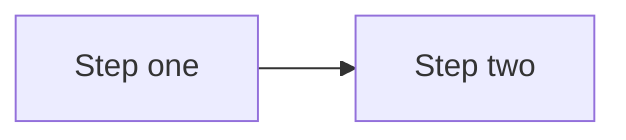

# Contributing

## Layout

```text
.
├── README.md                          # index of every article
├── notion-source.md                   # file → Notion page map
├── assets/                            # SVG diagrams referenced by articles
├── project-management/
├── code-repository-management/
├── issue-process-guide/
├── individual-contributor-dev-guide/
├── people-management/
└── learning-resource/
```

Each section folder has a `README.md` listing its articles, and one `.md` file per article.

## Adding an article

1. Create `section-name/article-title.md` (kebab-case, ASCII only).
2. Start the file with a single `# Title` heading; use `##`/`###` below it.
3. Add a row for it in the section `README.md` and in the top-level `README.md`.
4. If it came from Notion, add a row to `notion-source.md`.

## Diagrams

Prefer a **Mermaid** code block — GitHub renders it, and it diffs cleanly in pull requests:

````markdown

````

Use `flowchart` for processes, `gitGraph` for branching models, `gantt` for schedules, `pie` for proportions, `stateDiagram-v2` for ticket workflows.

When a picture cannot be expressed in Mermaid (radar charts, concentric "onion" rings, free-form sketches), add an **SVG** to `assets/` and reference it with a relative path and meaningful alt text:

```markdown

```

Avoid committing PNG/JPEG screenshots — they cannot be edited or diffed.

## Markdown conventions

- Callouts: use GitHub alerts — `> [!TIP]`, `> [!NOTE]`, `> [!IMPORTANT]`, `> [!WARNING]`.
- Tables: standard pipe tables.
- Cross-references: relative links (`../project-management/software-development-lifecycle.md`), never absolute Notion URLs.
- Underlined text from Notion is written as `<ins>text</ins>`.
- Leave a blank line before and after lists, tables, headings and code fences.

## Checking your changes

```bash
npx markdownlint-cli2 "**/*.md"          # lint
npx @mermaid-js/mermaid-cli -i file.md   # optional: render Mermaid locally
```

GitHub's Markdown preview (or the VS Code "Markdown Preview Mermaid Support" extension) is the quickest way to confirm a diagram renders.
