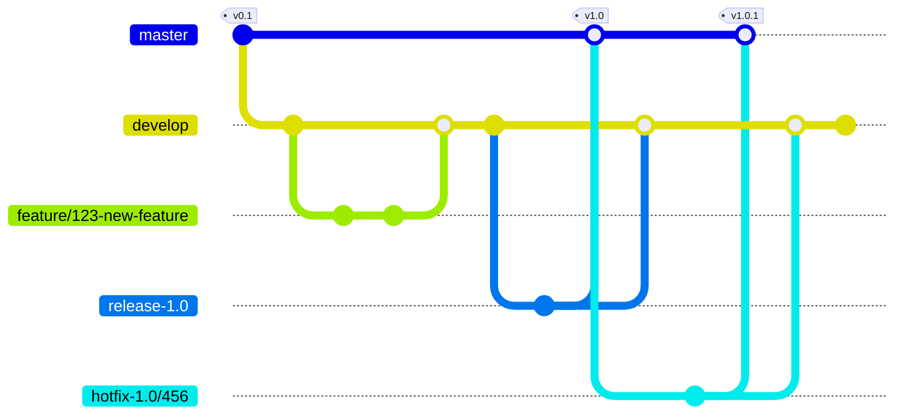
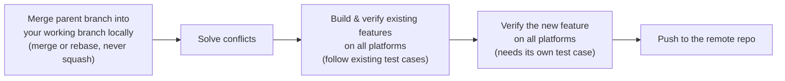
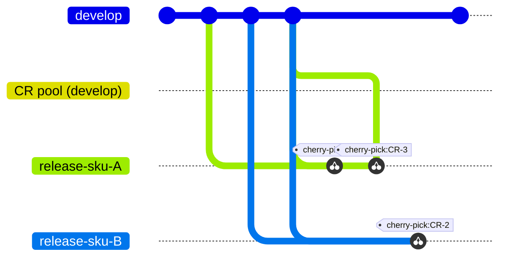

# Git flow guide

## Table of contents

- [Git Flow](#git-flow)
- [Git branches](#git-branches)
- [Git commit rules](#git-commit-rules)
- [Branch in-sync process](#branch-in-sync-process)
- [Multiple individual contributors work on the same feature](#multiple-individual-contributors-work-on-the-same-feature)
- [Submit a merge request](#submit-a-merge-request)
- [Maintenance](#maintenance)

## Git Flow

> [!TIP]
> - [A successful Git branching model](https://nvie.com/posts/a-successful-git-branching-model/)
> - [The Secret to Better Version Control: GitFlow Explained](https://medium.com/@zaghdoudi.mohamed/the-secret-to-better-version-control-gitflow-explained-6cbb094780a4)
> - [淺談開發流程 — Git Flow 到 Trunk-Based Development 的團隊經驗雜談](https://medium.com/@shanpigliao/%E6%B7%BA%E8%AB%87%E9%96%8B%E7%99%BC%E6%B5%81%E7%A8%8B-git-flow-%E5%88%B0-trunk-based-development-%E7%9A%84%E5%9C%98%E9%9A%8A%E7%B6%93%E9%A9%97%E9%9B%9C%E8%AB%87-a956a379987)



- `master` branch for stable versions with tags
- `develop` branch for developing and QA candidates
- `feature` branch for new feature implementation
- `release` branch for release candidate
- `hotfix` branch for bug fixing

## Git branches

We will have to maintain 5 types of branches.

- `master`: Stable, direct to production.
- `develop`: Unstable, all feature changes will be pushed here.
  - Bugfixes on `develop`
    - Create a temporary branch name, then send a merge request to merge back to `develop`
    - Branch naming convention: `bugfix/{ticket number}`
- `feature`:
  - May branch off from: `develop`
  - Must merge back into the `develop`
  - Branch naming convention: `feature/{ticket number}-{semantic description}`
  - It's created when we have a new feature
- `release`: Supports preparation of a new production release
  - May branch off from `develop`
  - Must merge back into `develop` and `master`
  - Branch naming convention: `release-*` (e.g. release-1.0)
  - It's created when we have a release plan
- `hotfix`: Very much like release branches in that they are also meant to prepare for a new production release, albeit unplanned.
  - May branch off from `master`
  - Must merge back into `develop` and `release`
  - Branch naming convention: `hotfix-*` (e.g. `hotfix-1.0/{ticket number}`, from release-1.0)
  - It'd created when we have bugs on `master`

## Git commit rules

> [!TIP]
> Reference: [Conventional Commits](https://www.conventionalcommits.org/en/v1.0.0/)

Examples

```text
   Symptom:
Root Cause:
  Solution:
```

```text
<type>[optional scope]: <description>
[optional body]
[optional footer(s)]
```

## Branch in-sync process



As we know, an IC should create a branch for the implementation; however, once the development cycle is long, the working branch will be out of sync with the parent branch so the IC should keep the working branch synced with the parent branch from time to time, to maintain a minimum diversity in between. The process should be

- Merge the parent branch to your working branch locally then solve conflicts
  - Use normal `merge` or `rebase`, don't use `squash`
- Build and verify the existing features on all the platforms, should have a existing test case to follow.
- Verify the new features on all the platforms, should have a test case for the new feature.
- Push to the remote repo

Further readings,

- [Merge strategies and squash merge - Azure Repos](https://learn.microsoft.com/en-us/azure/devops/repos/git/merging-with-squash?view=azure-devops)
- [What Is the Difference Between a Merge Commit & a Squash?](https://blog.mergify.com/what-is-the-difference-between-a-merge-commit-a-squash/)
- [Should You Squash Merge or Merge Commit?](https://www.lloydatkinson.net/posts/2022/should-you-squash-merge-or-merge-commit/)
- [Squash, Merge, or Rebase?](https://matt-rickard.com/squash-merge-or-rebase)

## Multiple individual contributors work on the same feature

When a feature is big, we may need multiple ICs to work on the same branch, all the ICs should proceed with the "branch sync process" all the time.

## Submit a merge request

Before submitting a merge request, you should

- Proceed with the "branch sync process"
- Push your working branch to the remote
- Clone a brand new working branch and verify your working branch in a clean environment

## Maintenance



Sometimes, we will have multiple clients with different requirements, and different code freeze schedules, so we will maintain different SKUs (stock-keeping units) as release candidates. In this case, the code maintenance is much more complex, so we need something like a CR (change request) pool to hold all the changes, and then PdM will pick up the CRs based on the severity, test result, and schedule. (See [git flow](https://nvie.com/posts/a-successful-git-branching-model/), [git cherry-pick](https://git-scm.com/docs/git-cherry-pick))

- Branch in-sync process: In this case, the process should be applied with all the related SKUs.
