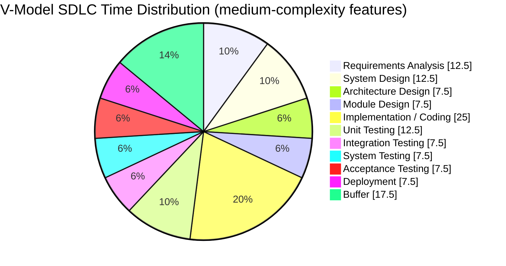

# Guide to Software Development Estimation

## Introduction

Accurate development estimation is one of the most challenging aspects of software project management. This guide provides a structured approach to creating reliable estimations based on the V-Model SDLC framework.

## Estimation Principles

### 1. Use Historical Data When Available

- Track actual time spent on previous similar features
- Calculate velocity metrics for your team
- Analyze estimation accuracy over time to identify patterns

### 2. Break Down Work into Small Units

- Decompose features into tasks of 8 hours or less
- Estimate at the task level, then roll up to feature level
- Use a Work Breakdown Structure (WBS) for complex features

### 3. Consider the Full V-Model Lifecycle

- Include all phases from requirements to deployment
- Allocate appropriate time for testing phases
- Remember the V-Model's verification relationship between phases

## V-Model Time Distribution Guidelines

> [!TIP]
> Quick Estimation Rule: Total Time ≈ Implementation Time × 4
> (Or approximately 3× for experienced teams with familiar technology)

The chart breaks down how time should be allocated across all phases:

### Development Activities (Left Arm of V):

- **Requirements Analysis**: 12.5% - Gathering and documenting feature requirements
- **System Design**: 12.5% - Defining how the feature fits into the overall system
- **Architecture Design**: 7.5% - Designing component interactions and interfaces
- **Module Design**: 7.5% - Detailed design of specific modules to be modified
- **Implementation/Coding**: 25% - The actual coding work

### Testing Activities (Right Arm of V):

- **Unit Testing**: 12.5% - Testing individual components
- **Integration Testing**: 7.5% - Testing interactions between components
- **System Testing**: 7.5% - Testing the complete system functionality
- **Acceptance Testing**: 7.5% - Validating against user requirements

### Other Activities:

- **Deployment**: 7.5% - Activities related to releasing the feature
- **Buffer**: 17.5% - Reserved time for unexpected issues and risk mitigation

This distribution follows V-Model principles by balancing development and verification activities. Note that while implementation/coding gets the largest single allocation (25%), the combined testing activities account for 35% of the total time, emphasizing the importance of quality validation.

The significant buffer (17.5%) reflects industry best practices for medium-complexity features where uncertainty and potential risks need to be accounted for in the estimation.

This visualization serves as a practical reference when estimating work and allocating resources across the software development lifecycle.

### Standard Distribution for Medium-Complexity Features

| Phase | Percentage | Notes |
| --- | --- | --- |
| Requirements Analysis | 10-15% | Includes stakeholder meetings and documentation |
| System Design | 10-15% | System-level impact analysis |
| Architecture Design | 5-10% | Component identification and interfaces |
| Module Design | 5-10% | Detailed design of code structures |
| Implementation/Coding | 20-30% | Actual coding work |
| Unit Testing | 10-15% | Testing individual components |
| Integration Testing | 5-10% | Testing component interactions |
| System Testing | 5-10% | End-to-end testing |
| Acceptance Testing | 5-10% | User validation |
| Deployment | 5-10% | Release preparation and execution |

### Scaled Distribution for Simple Features (1-day implementation)

For a feature with 1-day (8-hour) implementation time:

| Phase | Time Allocation | Percentage |
| --- | --- | --- |
| Requirements Analysis | 2 hours | 6.7% |
| System & Architecture Design | 4 hours | 13.3% |
| Module Design & Coding | 8 hours | 26.7% |
| Unit Testing | 4 hours | 13.3% |
| Integration Testing | 3 hours | 10% |
| System Testing | 3 hours | 10% |
| Acceptance Testing | 2 hours | 6.7% |
| Deployment | 2 hours | 6.7% |
| Buffer | 2 hours | 6.7% |
| **Total** | **30 hours** | **100%** |

### Extremely Compressed Timeline (8 hours total)

For urgent, low-risk features with severe time constraints:

| Phase | Time Allocation | Percentage |
| --- | --- | --- |
| Requirements Analysis | 30 minutes | 6.25% |
| System & Architecture Design | 60 minutes | 12.5% |
| Module Design & Coding | 180 minutes | 37.5% |
| Unit Testing | 60 minutes | 12.5% |
| Integration Testing | 45 minutes | 9.375% |
| System Testing | 45 minutes | 9.375% |
| Acceptance Testing | 30 minutes | 6.25% |
| Deployment | 30 minutes | 6.25% |
| Buffer | 30 minutes | 6.25% |
| **Total** | **8 hours** | **100%** |

## Estimation Process

### 1. Classify Feature Complexity

- **Simple**: Well-understood, minimal dependencies, limited scope
- **Medium**: Some unknowns, moderate dependencies, clear boundaries
- **Complex**: Many unknowns, significant dependencies, cross-functional

### 2. Select Base Estimation Method

- **Comparative**: Compare to similar past features (fastest)
- **Expert Judgment**: Gather estimates from experienced team members
- **Three-Point**: Use optimistic, realistic, and pessimistic estimates
  - Formula: (Optimistic + 4×Realistic + Pessimistic) ÷ 6

### 3. Apply V-Model Distribution

- Start with implementation time estimate
- Apply appropriate percentage distribution based on feature complexity
- Adjust as needed for project-specific factors

### 4. Add Risk Buffers

- **Simple features**: 10-20% buffer
- **Medium features**: 15-25% buffer
- **Complex features**: 25-40% buffer
- Distribute buffer across phases based on risk assessment

### 5. Validate Estimates

- Peer review by other team members
- Compare against historical data
- Rationalize significant deviations from past similar work

## Common Pitfalls to Avoid

### 1. Overlooking Non-Development Tasks

- **Communication overhead**: Meetings, emails, Slack discussions
- **Documentation**: Creating and updating documentation
- **Environment issues**: Setup, configuration, and troubleshooting

### 2. Ignoring Specific V-Model Considerations

- **Verification relationships**: Each left arm phase connects to right arm
- **Test planning**: Needs to happen early in the process
- **Rework cycles**: Account for potential back-and-forth

### 3. Pressure-Based Estimation

- Avoid reducing estimates due to pressure
- Document assumptions and risks when time constraints are imposed
- Communicate impact of compressed schedules on quality

## Advanced Techniques

### 1. Reference Class Forecasting

- Group similar past features as reference classes
- Apply statistical analysis to predict future performance
- Adjust for complexity differences

### 2. Monte Carlo Simulation

- Use probability distributions instead of single-point estimates
- Run simulations to determine confidence levels
- Provide range estimates (e.g., "90% confident we'll finish in 3-4 days")

### 3. Planning Poker

- Team-based estimation technique
- Reduces anchoring bias
- Leverages collective team experience

## Conclusion

Effective estimation in the V-Model SDLC requires balancing development and verification activities. By systematically considering all phases and applying appropriate buffers based on complexity and risk, teams can create more accurate and reliable estimates.

Remember that estimation is both art and science - continuous improvement through regular retrospectives and estimation reviews will help refine your approach over time.
