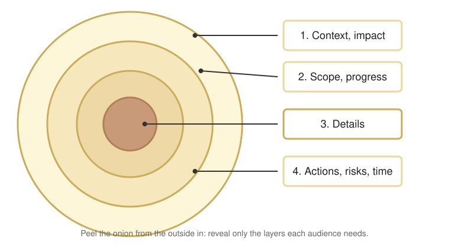

# Guide to Status Reports

## Table of contents

- [Context](#context)
- [Things to be kept in your mind](#things-to-be-kept-in-your-mind)
- [Report Structure](#report-structure)
  - [Examples: Reporting in regular division meetings and daily standup](#examples-reporting-in-regular-division-meetings-and-daily-standup)
  - [Examples: Reporting in functional team meetings](#examples-reporting-in-functional-team-meetings)

## Context

While working on a group project, we have lots of chances to talk about our progress. This article is to address a clear and efficient way to present the work that you have finished and your plan going forward.

In a group project, there are many from different technical areas, and they don't share the same domain. Therefore, instead of talking about the details directly, first start by describing an outline of what you are going to discuss. Let's look into the concepts and examples.

## Things to be kept in your mind

When we talk about our progress, please remember who we are talking to, what background knowledge they have, and what they care about the most. There are a few things we should always keep in mind when we report our progress.

**Problem-based presentation**

Instead of talking about what did in chronological order, we should first describe the context of the problem that you are going to solve, this well set the scene for the rest of the presentation and make it easier to understand; why do you work on current tasks? What's the impact if the problem is not solved?

**Conclusion first**

If your target audience are product managers, they don't have much time and don't really care about the details either, all they want to know are scope, progress, deadline, risks, and actions. Putting the main content as a reference but extracting what they care about the most in the front is an efficient way to describe the status.

Originally, it would be in the order of 1) Context, problems; 2) Scope and progress; 3) Details; 4) Actions, timeframe, and risks. However, in a status report, we should rearrange it a bit like: 1) Context, problems; 2) Scope and progress; 3) Actions, timeframe, and risks; 4) Details. In some cases, we might even just concisely talk about 1) Scope and progress; 2) Actions, timeframe, and risks.

**Onion structure**

Organizing your status report with an onion structure will make it easy to fit into different occasions. We should only reveal the necessary information to different audiences accordingly. For example, only the 1st and 2nd layers in the most of meetings, but only talking about the 3rd layer in your functional team meetings or technical meetings. When we report to CEO or PdMs, we describe the problem, progress, actions, and timeframe, but no details. We will give examples later.

**Project management tools**

Before jumping into a status report, please make sure your status on those tools is up-to-date, e.g. Jira ticket. Ideally, if the dev team members are updating the Jira properly, PdMs should be able to monitor the progress by checking out the Jira without asking any questions.

## Report Structure

> [!TIP]
> Four keys: 1) <ins>Context, impact</ins>; 2) <ins>Scope, progress</ins>; 3) <ins>Details</ins>; 4) <ins>Actions, timeframe, and risks</ins>;
>
> Layers to be presented: **m** – mandatory; **o** – optional

Any kind of report, verbal or written, should contain the following four parts, and how much content will be included depends on the length of the meeting.

- Context of problems
  - Reason: Always start from the context and describe the reason why you are even working on the tasks
  - Impact: How severe the problems are, and what happens if they aren't solved?
- Scope and progress
  - Plan: Give an overall scope of the solution and the obstacles that we should conquer
  - Milestones: Based on the plan, how long it will take for each task, and when it will be delivered.
  - Progress: Upon the plan, provide a task list and show people where we currently are. For example, the work is divided into 5 tasks and once we conquer from 1 to 5 we will call it done.
- Details
  - Describe the details of implementations and the background knowledge
- Actions, timeframes, and risks as a summary
  - Actions: What are the next actions you'll take, other options?
  - Timeframe: Give a proper estimation of the due date.
  - Risks: Foresee potential blockers that will delay the deliverables

### Examples: Reporting in regular division meetings and daily standup

- Participants: PdM, and all the developers from different functional teams.
- Report time: a couple of minutes (less than 3 min)
- Preparation: the report structure
  - **o** Context, impact: It depends since the team may already understand the context
  - **m** Scope, progress: Always repeat the outline/milestones then indicate where we are; and what else we need to achieve (to-dos)
  - **o** Details: **ONLY** talk about the details in your functional team meetings, or if someone is asking
  - **m** Actions, risks, and timeframe: Give your actions and delivery date for the current task; risks should be included if any
- Presentation: The focus and order
  - **(context) – scope – action – (details)**

### Examples: Reporting in functional team meetings

- Participants: Functional manager, and functional team members (may/may not) work on the same project
- Report time: longer time to report (3 to 10 min)
- Preparation: the report structure
  - **o** Context, impact: It depends since the team may already understand the context
  - **m** Scope, progress: Always repeat the outline/milestones then indicate where we are; and what else we need to achieve (to-dos)
  - **m** Details: Please always use the "Report Structure" to divide your work recursively even in your functional team
  - **m** Actions, risks, and timeframe: Give your actions and delivery date for the current task; risks should be included if any
- Presentation: The focus and order
  - **(context) – scope – details – action**
