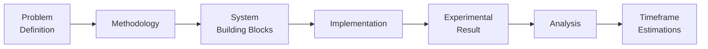

# How to present an R&D proposal

> [!TIP]
> - **Provide sufficient information for the decision making**
> - Not only to show the methodologies, but also show the feasibility based on our system

## Context

The R&D team works on broad research topics and contributes to the project team, so here we will talk about how the research results are transferred to productionable outputs, how we communicate with the project team, and what information we should provide.

## Coverage

### Problem Definition

Describe the problem you try to solve clearly

- Example: [Proposal - SfM-based relocalization for AR Cloud | Introduction](https://pretia.atlassian.net/wiki/spaces/RD/pages/2003730453/Proposal+-+SfM-based+relocalization+for+AR+Cloud#Introduction)

### Methodology

What method you proposed, and why? What are the improvement, benefits, pros & cons?

- Example: [Proposal - SfM-based relocalization for AR Cloud | Possible solutions](https://pretia.atlassian.net/wiki/spaces/RD/pages/2003730453/Proposal+-+SfM-based+relocalization+for+AR+Cloud#Possible-solutions)

### System Building Blocks

How does the method apply to our current system? How big the changes are?

- Example: [Proposal - SfM-based relocalization for AR Cloud | Overview of the proposed workflow](https://pretia.atlassian.net/wiki/spaces/RD/pages/2003730453/Proposal+-+SfM-based+relocalization+for+AR+Cloud#Overview-of-the-proposed-workflow)

### Implementation

Are we gonna do it from the scratch? Are there existing codes? How about the software license?

- Example: [Proposal - SfM-based relocalization for AR Cloud | Libraries and frameworks](https://pretia.atlassian.net/wiki/spaces/RD/pages/2003730453/Proposal+-+SfM-based+relocalization+for+AR+Cloud#Libraries-and-frameworks)

### Experimental Result

Show the experiment to convince the team to accept the proposal

- Example: [Proposal - SfM-based relocalization for AR Cloud | Results](https://pretia.atlassian.net/wiki/spaces/RD/pages/2003730453/Proposal+-+SfM-based+relocalization+for+AR+Cloud#Results)
- Example: [SfM experiments](https://pretia.atlassian.net/wiki/spaces/RD/pages/2355167242/SfM+experiments?NO_SSR=1)

### Analysis

Give comparisons, pros & cons, your insights, and suggestions for the decision making

- Example: [Proposal - SfM-based relocalization for AR Cloud | Benefits and drawbacks](https://pretia.atlassian.net/wiki/spaces/RD/pages/2003730453/Proposal+-+SfM-based+relocalization+for+AR+Cloud#Benefits-and-drawbacks)
- Example: [Proposal - SfM-based relocalization for AR Cloud | Challenges](https://pretia.atlassian.net/wiki/spaces/RD/pages/2003730453/Proposal+-+SfM-based+relocalization+for+AR+Cloud#Challenges)

### Timeframe Estimations

Based on the proposed approaches, give estimations of different approaches
