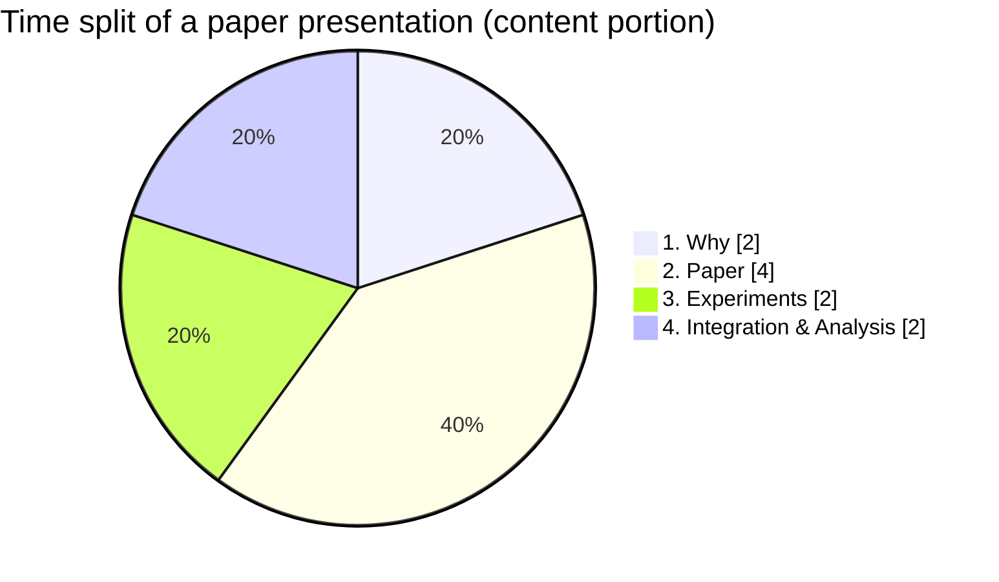

# Paper Presentation Structure

## Context

This is a guideline for what content should be included in the presentation with the **R&D team** as the target audience.

## Main Sessions

The presentation will be one hour and the content is usually around 40 min and 20 min for the Q&A and discussion. The presentation should include the main sessions below.

**1. Why (2/10)**

The reason you look into this method and why we need this, what problem we can solve through this method

**2. Paper (4/10)**

Talk about the method and the detail that is introduced by the paper, what are the background stories? What are the constraints/assumptions?

**3. Experiments (2/10)**

What does your experiment result? Do you see that the paper's conclusion is convincing?

**4. Integration & Analysis (2/10)**

From our products, how do we apply the method? How big the changes are? Is it a short-term, mid-term, or long-term adaptation? What are the pros & cons from your eyes?
