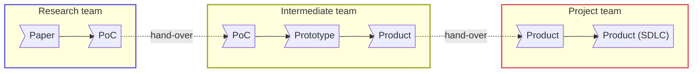

# R&D Role and Responsibility

Development phases (Paper → PoC → Prototype → Product → Product/SDLC) and which team owns each phase:

| Team \ DevPhase | Paper | PoC | Prototype | Product | Product (SDLC) |
| --- | :---: | :---: | :---: | :---: | :---: |
| Research | ✅ | ✅ | | | |
| Intermediate | | ✅ | ✅ | ✅ | |
| Project | | | | ✅ | ✅ |

### Computer Vision Research and Development

**The R&D team: research + intermediate**

Research Team Responsibility

- Broadly research, simulate and implement new features
- Mobile-cloud-based proof of concept and prototyping

Intermediate Team Responsibility

- Design and build advanced SDKs for Unity developers
- Collaborate with cross-functional teams of Unity and backend
- End-to-end development, e.g. problem analysis, research, prototyping, bug fixing, shipping
- Continuously improvement of the features

### Development and Engineering (Android, iOS, Unity)

**The Unity team in Plat project**

Project Team Responsibility ([SDLC](../project-management/software-development-lifecycle.md))

- Design and build advanced iOS SDKs for Unity developers
- Ensure the performance, quality, and responsiveness of SDKs
- Work closely with the team of R&D, Unity, and backend.
- Collaborate with cross-functional teams to define, design, and ship new features.
- Unit-test code for robustness, including edge cases, usability, and general reliability.
- Work on bug fixing and improving application performance.
- Maintaining the code and atomization of the application
