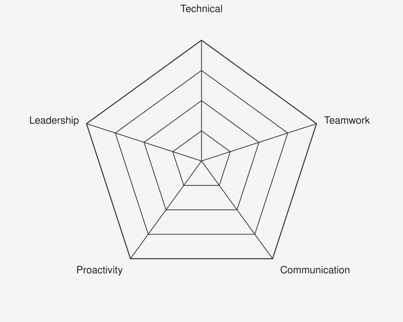
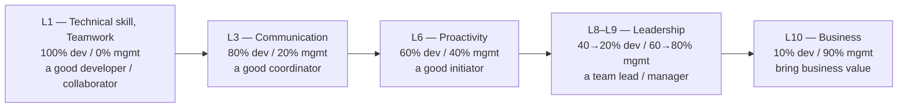

# Software Engineer Expectations

> [!TIP]
> [Software developer growth path](https://docs.google.com/spreadsheets/d/1nDSGL5ZIs85ogQD9VXNbCwGS4YPhSZ15un6jE3Cwmps/edit?usp=drive_link) As described, technical skills, teamwork, communication and proactivity are developed from L1. Let's focus on the ***leadership*** here.

## Overview

- **Hard skills**: software engineer (SWE) skillsets and domain knowledge, e.g. computer vision, platform-specific knowledge, …etc.
- **Soft skills**: teamwork, communication, proactivity, leadership, market-oriented thinking.

## Skills by level

| Skills | Junior (L1) | Middle (L3) | Senior (L6) | Lead (L8) | Head (L10) |
| --- | :-: | :-: | :-: | :-: | :-: |
| Technical skills | x | x | x | x | x |
| Teamwork | x | x | x | x | x |
| Communication | | x | x | x | x |
| Proactivity | | | x | x | x |
| Leadership | | | | x | x |
| Business | | | | | x |

## Growth path: level, time split, and focus

Each level below is the point a skill is introduced; earlier skills continue to apply. "Development / management" is the approximate time split at that level.

| Skill | Level | Development % | Management % | Focus | Descriptions |
| --- | --- | :-: | :-: | --- | --- |
| Technical skill | L1 | 100 | 0 | a good developer | accumulate domain knowledge and programming skills |
| Teamwork | L1 | 100 | 0 | a good collaborator | talk to people from different technical areas, and work smoothly; analyze/clarify the requirement; make proper design docs, and discuss with the team |
| Communication | L3 | 80 | 20 | a good coordinator | be a feature owner, and be able to handle a feature from analysis, design, implementation, testing, and review; act as a tech lead |
| Proactivity | L6 | 60 | 40 | a good initiator | take the actions autonomously; identify the drawbacks and make proposals, e.g. give constructive suggestions |
| Leadership | L8, L9 | 40 ~ 20 | 60 ~ 80 | a team lead/manager, help the team grow | see below |
| Business | L10 | 10 | 90 | bring business value | seek for business opportunities; as developing, taking business requirements into account |

### Leadership (L8, L9) in detail

**Process management**

- Take the responsibility of the functional team
- Handle the ambiguous job, messy problems, unclear goals, e.g. project scope, schedule estimation
- Planning: development plan and delegate team resource
- Reviews: control quality assurance on all the team feature delivery, e.g. design, impl, test, …etc.

**Growth (people management)**

- Create a working culture, define the core values, e.g. team words
- Growth the team, show them career paths, growing plan
- Focus on polishing the team technical skills, increase the depth and width
- Knowledge sharing, presentations, mentoring
- Recruiting process: find right people in the right position

**Impact**

- Create impact of team/company (contribution)
- Turn business strategy into technical requirements

## Management (team deliverables)

- Take responsibility for the functional team
- Handle the ambiguous job, messy problems, and unclear goals, e.g. project scope, schedule estimations
- Planning: Develop and delegate team resource
- Reviews: control quality assurance on all the team feature delivery, e.g. design, implementation, and test.
- Role: This could be done by a technical lead, that is, not only L8+ leads, but senior ICs should be able to do this.

## Growth

- Create a working culture, and define the core values, e.g. team words, dev processes
- Growth the team, show them career paths, growing plan
- Focus on polishing the team's technical skills, increase the depth and width
- Knowledge sharing: Arrange presentations, do the mentoring
- Recruiting: Find the right people in the right position

## Impacts

- Create contributions to the organization
- Turn business strategy into technical requirements
