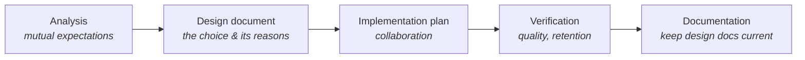

# Steps in Software Development Process (WIP)

## Overview

When you work on a group project, the project is not yours but belongs to the team, so continuously sharing the process with the team and making it visible to all the members is essential.

This article is to address some good work habits of individual developers and what they should involve in their daily work. I will talk about the process and checkpoints in each part. A structure would align with the [Project Development Life Cycle](../project-management/software-development-lifecycle.md) with:

- Analysis
- Design document
- Implementation plan
- Verification
- Documentations

## Analysis

> [!TIP]
> It's all about the mutual expectations.

Whenever we got a request, analyzing the requirement is the first thing we should do. It will help us to communicate the expectations on both sides. The main focus would be

- Understand the context, the requirements and the problem to be solved
- Clarify the user scenarios and deliverables, what the expectation is, what to deliver

Things should be included in an analysis

- User journey
- Feature specs

## Design document

> [!TIP]
> It's all about the choice, so the causes and explanations are the key to a design document.

Share your thoughts, how/why you make the design decisions, what kinda studies you made

- Comparison of different solutions, approaches
- Put all the records in the design document

The design document should come with a test plan as well

It's about the process but not the conclusion. We would like to know the reason that the developer made the decision. Because the requirements may change, the feature may be updated or obsoleted, and with sufficient context and historical causes, the newer people would know how to make modifications.

Things should be included in a design document

- Problem definition
- Inputs and outputs
- The solutions

## Implementation plan

> [!TIP]
> It's all about the collaborations

Break down the tasks and put them into different subtasks with priorities and dependencies.

## Verification

> [!TIP]
> It's all about the quality, retention

When finishing the implementation, share the verification result; may include known issues either.

## Documentations

Make sure all the information on the design documents is up-to-date

## Communications

### Status track

- [Guide to Status Reports](guide-to-status-reports.md)

### Presentations

*(To be written.)*
