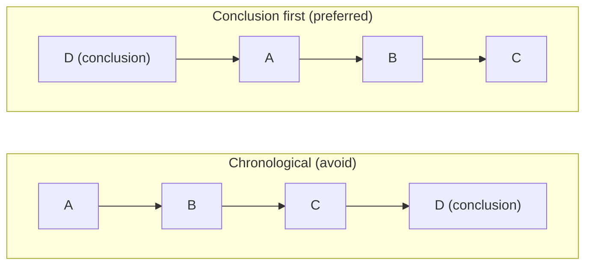

# Technical Presentation Tips

## Before You Start

The presentation doesn't mean making slides, but you must have a proper plan, including strategy, design, and delivery.

- **Strategy**: Understand who the audience is. What language the speaker should use, and the audience will understand
- **Design**: Deliberately construct your presentation, including opening, body, and ending
- **Delivery**: Figure out how to make the content easy to understand; use illustrations and images, as simply as possible to deliver the ideas you want to share. Mathematics and equations are not suitable materials for explanation most of the time.

> Use the way that people can understand to introduce the idea that they don't understand.

## Tips

### Tell A Story

The speaker should create a connection between the topic and the audience. Asking yourself the following questions all the time:

- Why: why the audiences need to know it
- How the impact: if the audiences don't know, what they will lose, if they know, what benefits are
- How: how the problem is solved, how the methods are applied

### Keep Simple and Precise

Put the minimum required new terminologies in the slides since people won't memorize dozen of new terminologies in a presentation.

### Problem-Based Presentation

Ask a question and address a problem first, then introduce the solution to the problem. This will create a quick link between addressing the problem and the audience, then guide them to the solution.

### Conclusion First

The result and conclusion should be delivered in the beginning. To keep the audience interested in the presentation without falling asleep, the speaker should take about the conclusion and impact in the very beginning. Rather explain the consequence from the beginning and derivative the solution, it's better to address the problem and conclusion, then talk through the journey, for example:

- if the order is: A → B → C → D (conclusion)
- we should put it this way: D; A → B → C

### Recapitulation

At the end of the presentation, give a summary to recapitulate the main idea precisely, don't make the audience feel like sitting there for an hour but getting nothing back.
