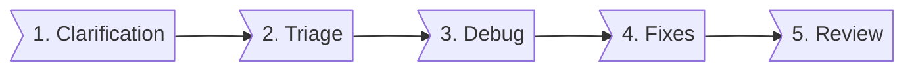

# Issue solving process



## 1. Clarification

For the issue report, we should clarify the issue, try to figure out how to reproduce the issue first, then jump into debugging. I guess we should set up a protocol to handle the issue report, like

1. clarify what's going on there, e.g. symptoms, the reproducible steps, software version, frequency, …etc. (see [template](issue-reporting-process.md#bug-report-template))
2. looking into the log file (if any)
3. reproduce the issue on our side: if we could, then we can work on the solution
4. reproduce the issue on our side: if we couldn't, then there are a couple of things we can do
   1. ask the reporter to help us by providing more information, e.g. log, environmental setup, project setup, …etc.
   2. give the reporter test build with more log enabled (if we could)
   3. give the reporter debugging tools (if we could)
   4. have a developer on side support (if necessary)

## 2. Triage

Identify the issues and find a function owner to dig deeper.

## 3. Debugging

- Review the released test reports, compared with the workable cases, e.g. benchmarks, reference device/scenario, …etc.
- Module division, e.g. by data pipeline
- May change the issue owner at this stage
- Find the root cause

## 4. Deliver solutions

> No reopen

A fix shall be verified before (a) and after (b) push to a repository, and before releasing a new version (c).

- Verifications
  1. Verifying the fix
  2. Push commit to the repo
  3. Pull the latest commit and verify again (in large projects, it's possible to have conflicts / exclusive effects among several fixes)
- Information format for a bugfix

```text
Symptom:
Analysis:
Root cause:
Solution:
Fix (commit id):
Test report (link):
```

## 5. Review & Retrospective

Document the fix and add a new test case for this issue/scenario if possible, to prevent this issue occurred in the future.
