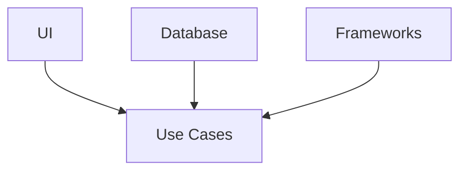
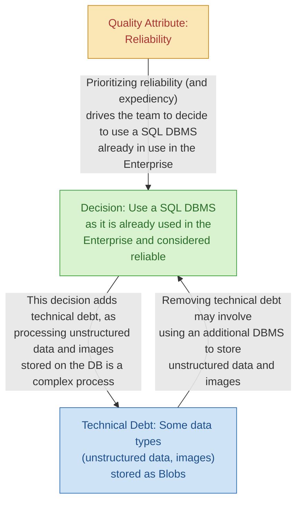
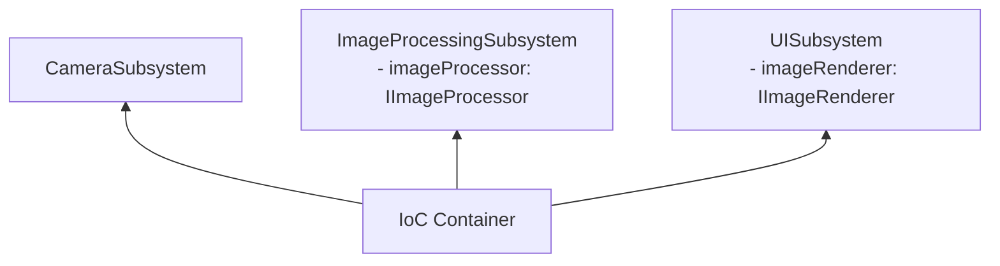

# The Clean Architecture Materials

## Table of contents

- [The Clean Architecture](#the-clean-architecture)
- [Software Architecture](#software-architecture)
- [Articles](#articles)
- [Software architectural design patterns](#software-architectural-design-patterns)
- [How to check if a codebase complies with clean architecture](#how-to-check-if-a-codebase-complies-with-clean-architecture)
- [Example scenario](#example-scenario)

## The Clean Architecture

- Architecture is about intent.
- A good architecture allows major decisions to be deferred.
  - Allows you to make decisions late, decisions about UI, database, and framework, because you can implement all the use cases without them
- A good architect maximizes the number of decisions not made.
  - Later is always better when you're making decisions, you have more information later.
- Clean Architecture is a set of principles and guidelines for building software systems that are **easy to maintain, test, and extend**. It places a strong emphasis on the separation of concerns, decoupling, and testability.
- Reference: [Clean Architecture - 2020 Pretia SDK](https://hackmd.io/Rba3sEsLS5ywPICGU_yKZw)
- Confluence: [3D scanner app architectural review](https://pretia.atlassian.net/l/cp/ib6WUJMg)
- Reference
  - <https://blog.cleancoder.com/uncle-bob/2012/08/13/the-clean-architecture.html>
  - <https://github.com/android10/Android-CleanArchitecture-Kotlin>
  - <https://github.com/SmartDengg/android-clean-architecture-boilerplate>

The dependency rule: everything points inward to the use cases; UI, database and frameworks are plug-ins.



1. Independent of Frameworks. The architecture does not depend on the existence of some library of feature-laden software. This allows you to use such frameworks as tools, rather than having to cram your system into their limited constraints.
2. Testable. The business rules can be tested without the UI, Database, Web Server, or any other external element.
3. Independent of UI. The UI can change easily, without changing the rest of the system. A Web UI could be replaced with a console UI, for example, without changing the business rules.
4. Independent of Database. You can swap out Oracle or SQL Server, for Mongo, BigTable, CouchDB, or something else. Your business rules are not bound to the database.
5. Independent of any external agency. In fact, your business rules simply don't know anything at all about the outside world.

## Software Architecture

Software Architecture: It Might Not Be What You Think It Is ([link](https://www.infoq.com/articles/what-software-architecture/))

- Software architecture is about decisions, not structure
- Architecting is a skill; Architect is not a role
- Architecting means continuously exploring

Figure: Relationships between QAR, Decision, and Technical Debt



## Articles

- [Implementing Clean Architecture - Case Study: Sending e-mails](http://www.plainionist.net/Implementing-Clean-Architecture-CaseStudy-Mails/)
- Robert C Martin - Clean Architecture and Design
  - [The Clean Architecture](https://blog.cleancoder.com/uncle-bob/2012/08/13/the-clean-architecture.html)
  - [Robert C Martin - Clean Architecture and Design](https://youtu.be/Nsjsiz2A9mg)
- [Android - Clean Architecture - Kotlin](https://github.com/android10/Android-CleanArchitecture-Kotlin)
- [Android Easy Clean Architecture Boilerplate](https://github.com/SmartDengg/android-clean-architecture-boilerplate)
- [Onion vs Clean vs Hexagonal Architecture](https://medium.com/@edamtoft/onion-vs-clean-vs-hexagonal-architecture-9ad94a27da91)
- [Hexagonal, Onion & Clean Architecture](https://youtu.be/JubdZIdLQ4M)
- [Flutter TDD Clean Architecture Course](https://www.youtube.com/playlist?list=PLB6lc7nQ1n4iYGE_khpXRdJkJEp9WOech)
- [DDD Bounded Contexts & Subdomains](https://youtu.be/NvBsEnDgA4o)
- [Unity Architecture - How I Keep Large Architecture Easy to Maintain](https://youtu.be/uUZvtLZ-anQ)
  - <https://github.com/DanVioletSagmiller/CodavoreCore>
- [An example that demonstrates best practices for implementing the clean architecture in a .NET Core application](https://github.com/jasontaylordev/CleanArchitecture)
- Dependency injection
  - <https://youtu.be/tYZd8hserms>
  - <https://youtu.be/l6Y9PqyK1Mc>

## Software architectural design patterns

Here are some examples of each of the architectural patterns:

### Model-View-Controller (MVC):

Example: A web application built using Ruby on Rails framework implements the MVC pattern by separating the model (database and business logic), view (HTML/CSS templates), and controller (handling user requests) components.

### Model-View-ViewModel (MVVM):

Example: A mobile application built using Xamarin framework implements the MVVM pattern by separating the model (data and business logic), view (user interface), and ViewModel (mediator between view and model) components.

### Layered Architecture:

Example: A web application built using Java Spring framework implements the layered architecture pattern by dividing the application into three layers: Presentation layer (UI), Business layer (business logic), and Data access layer (database access).

### Domain Driven Design (DDD):

Example: An e-commerce application built using Node.js implements the DDD pattern by modeling the domain concepts such as products, customers, orders, and payment methods.

### Microservices:

Example: A cloud-based application built using AWS Lambda implements the microservices pattern by breaking down the application into small, independent services that perform specific tasks such as authentication, billing, and user management.

### Event-Driven Architecture (EDA):

Example: A financial trading platform built using Apache Kafka implements the EDA pattern by using events to communicate between different components of the system. For example, events can be used to represent stock prices or trade executions.

### Clean Architecture:

Example: A mobile application built using [Flutter](https://flutter.dev/) framework implements the clean architecture pattern by separating the application into different layers such as domain, use case, data, and presentation layers. The domain layer contains the business logic, the use case layer contains application-specific use cases, the data layer contains data access code, and the presentation layer contains UI-related code.

---

## How to check if a codebase complies with clean architecture

The Clean Architecture is a set of principles and guidelines for building software systems that are easy to maintain, test, and extend. It places a strong emphasis on separation of concerns, decoupling, and testability. Here are some steps you can follow to review a codebase to determine if it complies with Clean Architecture:

**Understand the Clean Architecture Principles**: Before you can review a codebase for Clean Architecture compliance, you should have a good understanding of the Clean Architecture principles. You can start by reading the original blog post by Robert C. Martin (Uncle Bob) or his book "Clean Architecture: A Craftsman's Guide to Software Structure and Design."

**Identify the Architecture**: Identify the architecture of the codebase you are reviewing. Is it a monolithic architecture or a microservices architecture? Are there clear boundaries between the components or modules of the system?

**Identify the Layers**: Look for evidence of a layered architecture in the codebase. The layers should be clearly separated, with each layer having a distinct responsibility. In general, the layers in Clean Architecture are:

- **Presentation Layer**: Handles <ins>***user interaction***</ins> and presentation of data.
- **Application Layer**: Implements the <ins>***use cases***</ins> and business rules of the system.
- **Domain Layer**: Contains the business logic and <ins>***entities***</ins> of the system.
- **Infrastructure Layer**: Handles <ins>***external***</ins> interfaces and services, such as databases, file systems, and networks.

**Check for Dependency Rule**: Check if the codebase follows the Dependency Rule, which states that the dependencies between the layers should flow inwards. That is, outer layers should depend on inner layers, but inner layers should not depend on outer layers.

**Look for Separation of Concerns**: Clean Architecture emphasizes the separation of concerns, which means that different parts of the system should have clearly defined responsibilities. Look for evidence that the codebase follows this principle, with each module or component responsible for a single concern.

**Check for Testability**: Clean Architecture makes it easy to write unit tests for different parts of the system. Look for evidence that the codebase is designed with testability in mind, with clear boundaries between the components, and with each component having a well-defined interface.

**Evaluate the Code Quality**: Finally, evaluate the code quality of the codebase. Look for evidence of clean code practices, such as good naming conventions, small and focused functions, and meaningful comments. Also, look for evidence of SOLID principles, such as Single Responsibility Principle (SRP), Open-Closed Principle (OCP), Liskov Substitution Principle (LSP), Interface Segregation Principle (ISP), and Dependency Inversion Principle (DIP).

By following these steps, you can get a good idea of whether the codebase complies with Clean Architecture principles. However, keep in mind that Clean Architecture is not a strict set of rules or a silver bullet solution. It is a set of principles and guidelines that can help you build better software systems.

---

## Example scenario

Create an image processing subsystem that acquires images from camera subsystem, then provides API for UI to display processed point cloud points

To design a clean architecture for an image processing subsystem:

1. Understand the project requirements and goals. In this scenario, the goal is to create an image processing subsystem that acquires images from a camera subsystem and provides an API for displaying processed point cloud points in the UI.
2. Identify the key entities and use cases. The key entities in this scenario are the camera subsystem, the image processing subsystem, and the UI. The key use cases are acquiring images from the camera, processing images to generate point cloud data, and displaying the point cloud data in the UI.
3. Define the core business logic. The core business logic in this scenario is the image processing algorithms that generate the point cloud data. This logic should be independent of any specific technology or implementation details, and should be defined as a set of use cases or abstract classes.
4. Identify the boundaries between the layers. The clean architecture suggests dividing the system into layers, with each layer having a specific responsibility and clear boundaries between layers. In this scenario, we can define the following layers:
   - Presentation layer: responsible for displaying the point cloud data in the UI
   - Application layer: responsible for coordinating the interactions between the presentation layer and the image processing layer
   - Image processing layer: responsible for processing the images and generating point cloud data
   - Data access layer: responsible for accessing the camera subsystem and retrieving images

   We can define interfaces or abstract classes that define the interactions between these layers, such as a `IImageProcessingService` interface for the image processing layer.
5. Implement the layers and dependencies. Implement each layer of the architecture separately, using the defined interfaces or abstract classes to define the interactions between the layers. Use dependency injection to manage dependencies between the layers, so that each layer can be tested and developed independently of the others. For example, the `ImageProcessingService` class in the image processing layer might depend on an `ICameraService` interface in the data access layer to retrieve images, which can be injected using a dependency injection framework such as Unity.
6. Test and validate the architecture. Test the architecture to ensure that it meets the requirements and goals of the project. Validate that the architecture is modular, flexible, and maintainable. Make any necessary adjustments based on feedback and testing.

This example demonstrates how to apply the steps I described earlier to design a clean architecture for an image processing subsystem. Remember that the clean architecture is a flexible and adaptable approach, so feel free to adjust the architecture as needed to meet the specific requirements and constraints of your project.

### Dependency diagram



```text
+------------------+               +-------------------------+             +---------------------+
|  CameraSubsystem |               | ImageProcessingSubsystem|             |  UISubsystem        |
+------------------+               +-------------------------+             +---------------------+
|                  |               | - imageProcessor: IImage|             | - imageRenderer: IUI|
+------------------+               +-------------------------+             +---------------------+
          ^                                        ^                                        ^
          |                                        |                                        |
          +-------------------+--------------------+----------------------------------------+
                              |
                              |
                     +--------+--------+
                     | IoC Container   |
                     +-----------------+
```

### Sample codes

```csharp
// Data contract for image data
public class ImageData {
    // Properties for image data
    // ...
}

// Interface for image processing
public interface IImageProcessor {
    List<PointCloudPoint> ProcessImage(ImageData imageData);
}

// Interface for UI rendering
public interface IImageRenderer {
    void RenderImage(List<PointCloudPoint> points);
}

// Implementation of the camera subsystem
public class CameraSubsystem {
    public event Action<ImageData> OnImageAcquired;
    // ...
    private void AcquireImage() {
        // ...
        ImageData imageData = // acquire image data from camera
        OnImageAcquired?.Invoke(imageData);
    }
}

// Implementation of the image processing subsystem
public class ImageProcessingSubsystem {
    private readonly IImageProcessor imageProcessor;
    public ImageProcessingSubsystem(IImageProcessor imageProcessor) {
        this.imageProcessor = imageProcessor;
    }
    public void ProcessImage(ImageData imageData) {
        List<PointCloudPoint> points = imageProcessor.ProcessImage(imageData);
        // Pass points to the UI subsystem for rendering
        // ...
    }
}

// Implementation of the UI subsystem
public class UISubsystem {
    private readonly IImageRenderer imageRenderer;
    public UISubsystem(IImageRenderer imageRenderer) {
        this.imageRenderer = imageRenderer;
    }
    public void RenderImage(List<PointCloudPoint> points) {
        imageRenderer.RenderImage(points);
    }
}

// Implementation of the IoC container
public class Container {
    public static void RegisterDependencies() {
        // Register dependencies
        // ...
        // Register CameraSubsystem
        CameraSubsystem camera = new CameraSubsystem();
        ImageProcessingSubsystem imageProcessor = new ImageProcessingSubsystem(
            // Resolve IImageProcessor dependency
            container.Resolve<IImageProcessor>()
        );
        UISubsystem ui = new UISubsystem(
            // Resolve IImageRenderer dependency
            container.Resolve<IImageRenderer>()
        );

        // Subscribe to camera events
        camera.OnImageAcquired += imageProcessor.ProcessImage;
        imageProcessor.OnPointCloudProduced += ui.RenderImage;
    }
}
```
