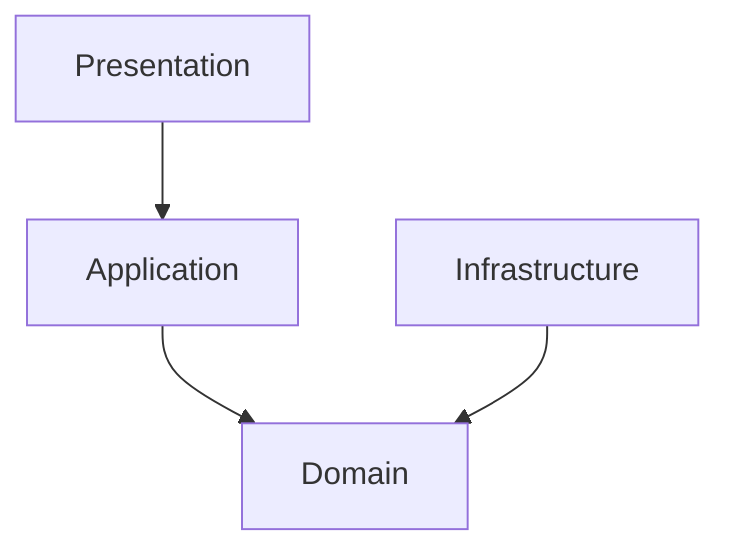
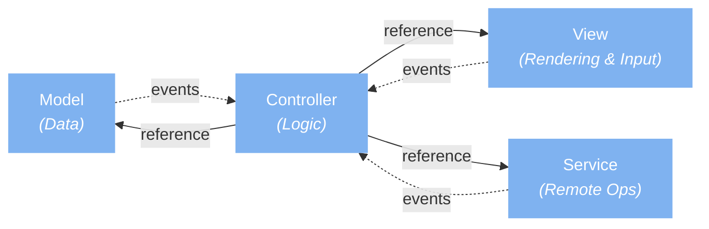

# The Clean Architecture on Unity

## Table of contents

- [Introduction](#introduction)
- [Example: Pretia Mapping App](#example-pretia-mapping-app)
- [Example 1: MVCS (Model-View-Controller-Service)](#example-1-mvcs-model-view-controller-service)
- [Example 2: MVC and MVP (Model-View-Presenter) ⭐](#example-2-mvc-and-mvp-model-view-presenter-)
- [Example 3: A well-architecture shared by Mohammed](#example-3-a-well-architecture-shared-by-mohammed)
- [Example 4: AMVCC (Application-Model-View-Controller-Component)](#example-4-amvcc-application-model-view-controller-component)

## Introduction

Clean Architecture is a software design principle that emphasizes separation of concerns and independence of external frameworks and tools. It provides a way to organize and structure the codebase in a modular and maintainable manner. While Clean Architecture is often associated with server-side applications or enterprise software, its principles can also be applied to Unity projects with some modifications.

Unity projects have their own unique characteristics, such as the game engine's component-based architecture, real-time rendering, and the need to handle user interactions and game logic efficiently. These factors may influence the way you approach software architecture in a Unity project.

Clean Architecture's benefits, such as testability, maintainability, and flexibility, can still be valuable in a Unity project. However, some adaptations may be necessary to align with the specific requirements of game development. Here are a few considerations:

1. Component-based architecture: Unity heavily relies on a component-based model, where game objects are composed of reusable and interchangeable components. To align with this paradigm, you may need to structure your codebase to work effectively with Unity's GameObjects, MonoBehaviours, and the component system.
2. Separation of concerns: Clean Architecture promotes separating business logic from external dependencies. In a Unity project, this could involve separating game mechanics, input handling, physics, rendering, and other Unity-specific functionality from domain-specific game logic.
3. Adapting to Unity's workflow: Unity provides its own framework, including scripting API and editor tools. When applying Clean Architecture, you may need to integrate and work within Unity's framework effectively, using it as a boundary for your clean architecture modules.
4. Performance considerations: Games often require high-performance code to achieve smooth gameplay. While Clean Architecture emphasizes loose coupling and abstractions, in performance-critical areas, you might need to optimize and fine-tune the code to meet the real-time demands of a game.

In summary, while Clean Architecture may require adaptations to align with Unity's unique characteristics, its principles of separation of concerns and maintainability can still provide benefits in organizing and structuring a Unity project. Consider the specific requirements of game development and adapt Clean Architecture to fit your needs while making the best use of Unity's framework.

---

## Example: Pretia Mapping App

```text
Example: mapping-app
   |----presentation
   |     |----ui
   |----application
   |     |----use cases
   |----domain
   |     |----entities
   |----infrastructure
         |----pretia sdk
         |----pretia servers (arc-reloc, arc-developer, ...)
         |----external servers (firebase)
```

Presentation

- Handle the data to be displayed on the UI
- Coordinate domain data and connect them to the presentation layer
- Example:
  - `/Assets/Scripts/NewUI/`, using MVC pattern maybe

Application

- Consider the business rules and implement the *use cases* by referring to the domain objects.
- The software in this layer contains *application specific* business rules.
- Example:
  - ARMappingManager (`Assets/Scripts/MappingController.cs`)
  - ARContentAuthoring, ContentAuthoringAndRecordingMenuController (`Assets/Scripts/NewUI/ContentAuthoringAndRecordingMenuController.cs`)

Domain

- Contains the core business logic and *entities* of the system.
- Example:
  - Mapping entity: ideally, the mapping app is the only presentation layer for this feature, we don't have any domain entity for the mapping entity in the mapping-app
  - Content authoring and session recording & playback entities: may have implementation logic here.

Infrastructure (data)

- The data sources and databases, where the data is from, and where the data is stored.
- Example:
  - pretia-sdk
  - arc-reloc, arc-developer, arc-map
  - FirebaseInit (`Assets/Scripts/FirebaseInit.cs`)

Dependency graph



- presentation → application
- application → domain
- Infrastructure → domain

## Example 1: MVCS (Model-View-Controller-Service)



*Solid arrows = references, dashed arrows = events.*

```text
MiniMVCS
├── Model
├── View
├── Controller
└── Service
or
MiniMVCS
├── Model
├── View
├── View
├── View
├── Controller
├── Controller
└── Service
or
App
├── MetaGameMiniMVCS
|   ├── Model
|   ├── View
|   ├── Controller
|   └── Service
|
└── CoreGameMiniMVCS
    ├── Model
    ├── View
    ├── Controller
    └── Service
```

Reference

- [Unity — Game Architectures — Part 1](https://sam-16930.medium.com/unity-game-architectures-part-1-dc53b3c7307d)
- [Unity — Game Architectures — Part 2](https://sam-16930.medium.com/unity-game-architectures-part-2-672958fcb33a)
- [Unity — Game Architectures — Part 3](https://sam-16930.medium.com/unity-game-architectures-part-3-d7c97b8ed2b)
- <https://github.com/SamuelAsherRivello/rmc-umvcs/tree/master>

## Example 2: MVC and MVP (Model-View-Presenter) ⭐

[Build a modular codebase with MVC and MVP programming patterns](https://unity.com/how-to/build-modular-codebase-mvc-and-mvp-programming-patterns)

## Example 3: A well-architecture shared by Mohammed

- [Project Files](https://pretia.atlassian.net/wiki/spaces/IM/pages/2424406068)
- [Unity Projects Standards](https://pretia.atlassian.net/wiki/spaces/IM/pages/2424242380)

It follows a good separation of domains: <https://assetstore.unity.com/packages/templates/unity-learn-fps-microgame-urp-156015>

## Example 4: AMVCC (Application-Model-View-Controller-Component)

AMVCC (Application-Model-View-Controller-Component)

[Unity with MVC: How to Level Up Your Game Development | Toptal®](https://www.toptal.com/unity-unity3d/unity-with-mvc-how-to-level-up-your-game-development)
