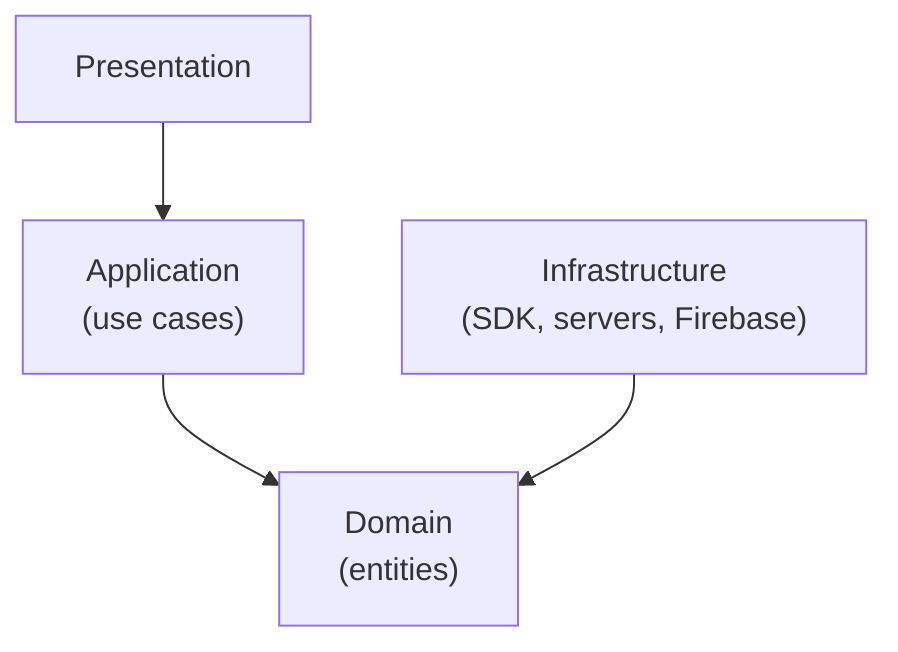

# The Clean Architecture

## Clean Architecture

> [!TIP]
> - Architecture is about intent.
> - A good architecture allows major decisions to be deferred.
> - Allows you to make decisions late, decisions about UI, database, framework, because you can implement all the use cases without them
> - A good architect maximizes the numbers of decisions not made.
>   - Later is always better when you're making decisions, you have more information later.
> - The Clean Architecture is a set of principles and guidelines for building software systems that are **easy to maintain, test, and extend**. It places a strong emphasis on separation of concerns, decoupling, and testability.

> [!NOTE]
> 📚 References
> - <https://blog.cleancoder.com/uncle-bob/2012/08/13/the-clean-architecture.html>
> - <https://github.com/android10/Android-CleanArchitecture-Kotlin>
> - <https://github.com/SmartDengg/android-clean-architecture-boilerplate>
> - Other (hexagonal, onion, clean): <https://youtu.be/JubdZIdLQ4M?si=Xu474oVDtfh7Zrff>

1. Independent of Frameworks. The architecture does not depend on the existence of some library of feature-laden software. This allows you to use such frameworks as tools, rather than having to cram your system into their limited constraints.
2. Testable. The business rules can be tested without the UI, Database, Web Server, or any other external element.
3. Independent of UI. The UI can change easily, without changing the rest of the system. A Web UI could be replaced with a console UI, for example, without changing the business rules.
4. Independent of Database. You can swap out Oracle or SQL Server, for Mongo, BigTable, CouchDB, or something else. Your business rules are not bound to the database.
5. Independent of any external agency. In fact, your business rules simply don't know anything at all about the outside world.

## Layer arrangement

```text
Example: mapping-app
   |----presentation
   |     |----ui
   |----application
   |     |----use cases
   |----domain
   |     |----entities
   |----infrastructure
         |----pretia sdk
         |----pretia servers (arc-reloc, arc-developer, ...)
         |----external servers (firebase)
```

<ins>Presentation</ins>

- Handle the data to be displayed on the UI
- Coordinate domain data and connect them to the presentation layer
- Example:
  - `/Assets/Scripts/NewUI/`, using MVC pattern maybe

<ins>Application</ins>

- Consider the business rules and implement the <ins>*use cases*</ins> by referring to the domain objects.
- The software in this layer contains <ins>*application specific*</ins> business rules.
- Example:
  - ARMappingManager (`Assets/Scripts/MappingController.cs`)
  - ARContentAuthoring, ContentAuthoringAndRecordingMenuController (`Assets/Scripts/NewUI/ContentAuthoringAndRecordingMenuController.cs`)

<ins>Domain</ins>

- Contains the core business logic and <ins>*entities*</ins> of the system.
- Example:
  - Mapping entity: ideally, the mapping app is the only presentation layer for this feature, we don't have any domain entity for the mapping entity in the mapping-app
  - Content authoring and session recording & playback entities: may have implementation logic here.

<ins>Infrastructure (data)</ins>

- The data sources and databases, where the data is from, and where the data is stored.
- Example:
  - pretia-sdk
  - arc-reloc, arc-developer, arc-map
  - FirebaseInit (`Assets/Scripts/FirebaseInit.cs`)

## Dependency graph



- presentation → application
- application → domain
- Infrastructure → domain
