# 1-on-1 Structure

## Table of contents

- [My Structure](#my-structure)
- [Enhanced 1-on-1 Structure (Monthly)](#enhanced-1-on-1-structure-monthly)
- [Making Each Section More Motivational](#making-each-section-more-motivational)
- [How to Structure Effective 1-on-1s for Process Adoption](#how-to-structure-effective-1-on-1s-for-process-adoption)
- [Prioritizing Processes for Implementation](#prioritizing-processes-for-implementation)

## My Structure

1. Opening
2. Career goal
3. Retrospective
4. Feedback to member
5. Ask member feedbacks to the team

## Enhanced 1-on-1 Structure (Monthly)

```mermaid
gantt
    title Enhanced monthly 1-on-1 (55 minutes)
    dateFormat mm
    axisFormat %M min
    section Agenda
    Opening                          :a1, 00, 5m
    Career Goals & Development       :a2, after a1, 10m
    Work Retrospective               :a3, after a2, 15m
    Performance & Process Feedback   :a4, after a3, 10m
    Team Improvement Discussion      :a5, after a4, 10m
    Action Planning                  :a6, after a5, 5m
```

**Opening (5 minutes)**

- Personal check-in
- Celebrate specific wins since last meeting
- Set the tone for an open conversation

**Career Goals & Development (10 minutes)**

- Review progress toward long-term goals
- *New element:* Connect process adoption to industry standards and career advancement
- "How are the documentation skills you're building now relevant to your goal of becoming a senior engineer?"

**Work Retrospective (15 minutes)**

- Review of recent work and challenges
- *Enhanced focus:* Identify process-related pain points they've experienced
- "What took longer than expected this month? Where did you get stuck?"
- Use their answers to naturally introduce how specific processes could help

**Performance & Process Feedback (10 minutes)**

- Share observations on their work quality and impact
- *Adaptation:* Frame process feedback as enablement rather than compliance
- "I noticed your API implementation was creative but lacked standard error handling. Let's discuss how consistent error handling would help both you and the team."

**Team Improvement Discussion (10 minutes)**

- Gather their feedback on team dynamics and processes
- *New element:* Ask for their ideas on process improvements
- "What one change to our development workflow would make your job easier?"
- This gives them ownership in the process creation

**Action Planning (5 minutes)**

- *New element:* Set 1-2 specific process-related goals before next meeting
- Make these achievable and meaningful to them specifically
- "Based on our discussion, it seems like focusing on test coverage for critical paths would have the biggest impact for you. How about we set a goal of 70% test coverage for your next feature?"

## Making Each Section More Motivational

The key to making this structure more motivational is how you approach each section:

1. **Ask more than tell**: "What do you think would happen if we had better documentation for this feature?" versus "You need to document your code better."
2. **Connect to their intrinsic motivations**: If someone values technical excellence, frame testing as craftsmanship. If they value efficiency, frame documentation as a time-saver.
3. **Use positive reinforcement**: "I noticed you added comprehensive tests to your last PR - that caught two edge cases that would have caused issues. That's exactly the kind of quality work I'm talking about."
4. **Create psychological safety**: Make it clear that adopting new processes will involve a learning curve, and you expect and support that adjustment period.

This enhanced structure maintains your comprehensive approach while strategically focusing on process adoption through motivation rather than mandate.

## How to Structure Effective 1-on-1s for Process Adoption

**1. Preparation**

- Review each team member's work patterns to identify their specific strengths and areas for improvement
- Prepare concrete examples of when lack of process created issues for this specific person
- Schedule at least 30-45 minutes in a comfortable, private setting

**2. Conversation Flow**

**Opening (5 minutes)**

- Start with genuine appreciation for their specific contributions
- "I value your technical creativity on the authentication system. You solve problems in ways I wouldn't think of."
- Frame the conversation: "Today I'd like to talk about how we can make our development process more sustainable as we grow."

**Discovery (10-15 minutes)**

- Ask open-ended questions to understand their perspective:
  - "What parts of our current development process work well for you?"
  - "Where do you feel slowed down or frustrated?"
  - "When you've worked on other projects, what practices helped maintain quality?"
- Listen actively and validate their concerns

**Connecting to Impact (5-10 minutes)**

- Share specific examples relevant to their work:
  - "Remember when we spent three days debugging that payment issue? Documentation would have cut that to hours."
  - "The feature you built last month is impressive, but I noticed you spent 40% of your time fixing issues that automated tests could have caught early."
- Focus on how process improvements benefit them directly:
  - "With better testing, you'd have more time for the creative work you excel at."
  - "Documentation would mean fewer interruptions from teammates with questions."

**Collaborative Solution (10 minutes)**

- Ask for their input: "What process improvements do you think would have the biggest impact on your productivity?"
- Propose specific, manageable changes: "What if we started with just adding automated tests for critical user paths?"
- Address concerns directly: "You mentioned time constraints—let's look at how we can build this into your workflow."

**Clear Agreement (5 minutes)**

- Establish concrete next steps: "So we agree you'll start including basic API documentation for new endpoints?"
- Set a reasonable timeframe: "Let's try this for two weeks and then discuss how it's working."
- Offer support: "I can pair with you on the first documentation set if that would help."

## Prioritizing Processes for Implementation

Start with processes that:

1. Address the most painful current problems
2. Provide quick, visible wins
3. Build foundation for further improvements

Here's a suggested order based on typical startup pain points:

**1. Basic Testing Framework** (First Priority)

- Immediate benefit: Reduces bugs reaching production
- Start with: Critical user paths only, then expand
- Implementation: Agree on minimum test coverage for new features (e.g., 70%)
- Measure success by: Reduction in production hotfixes

**2. Code Review Process** (Second Priority)

- Immediate benefit: Knowledge sharing and quality control
- Start with: Simple checklist of things to look for in reviews
- Implementation: No code merges without at least one review
- Measure success by: Improved code quality metrics and team learning

**3. Documentation Standards** (Third Priority)

- Immediate benefit: Reduces knowledge silos
- Start with: API endpoints and key architectural decisions
- Implementation: Templates that make documentation faster
- Measure success by: Time saved onboarding or troubleshooting

**4. Development Workflow** (Fourth Priority)

- Immediate benefit: Predictable delivery and workload
- Start with: Consistent branch strategy and ticket requirements
- Implementation: Clear definition of "ready" and "done" for tickets
- Measure success by: More accurate sprint planning and delivery
