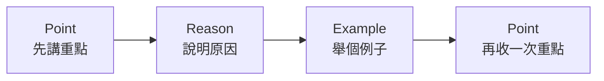

# Communication Skills

## Table of contents

- [論述: PREP Method](#論述-prep-method)
- [HERO](#hero)
- [描述經驗: STAR Method](#描述經驗-star-method)
- [CARI](#cari)
- [執行解決方案: What - Why - How](#執行解決方案-what---why---how)

## 論述: PREP Method

- Point：先講重點
- Reason：說明原因
- Example：舉個例子
- Point：最後再收一次重點

範例

- Point: 先講結論
  - 舉例：我覺得你應該要在晚回家的時候，提前跟我說一聲。
- Reason: 然後幫結論加上「因為」，然後完成句子，這就是你的完整主張
  - 舉例：因為我會擔心你，也會影響我安排晚上的事情。
  - 主張：請你晚回家的時候提前說一聲，這樣我不會一直等、也能安排自己的時間。
- Example: 拿出證據來證明為什麼你是對的
  - 舉例：像上禮拜那次你說下班就回來，結果兩個小時沒回訊息，我不只晚餐不知道要不要準備，還以為是不是發生什麼事了。
- Point: 主張最後要再連結到結論，增加「重要性」
  - 舉例：晚回家的時候「提前告知」可以讓我安心，這樣可以讓我們之間不會有誤會，不是限制你行動，而是讓彼此更安心。

## HERO

**1️⃣ H — Headline**

先用一句話講核心成果

不要用：「當時我們遇到一個問題…」
而是用：「我透過 onboarding redesign，讓首週 retention 提升 15%」

先讓中高階主管知道：你改變了什麼

**2️⃣ E — Effect**

這個成果對 business 有什麼影響？

例如：

- 提升 LTV
- 降低 churn
- 縮短 delivery timeline
- 提高 conversion
- 降低 operation cost

很多人面試只停在：「我有做事」
但中高階主管在意的是：「這件事有沒有 business value」

**3️⃣ R — Rationale**

這段最重要。

因為高階職位真正拉開差距的，通常不是 execution，而是 judgment。

例如：

- 為什麼 prioritization 這樣排？
- 為什麼放棄某方案？
- 怎麼做 trade-off？
- 怎麼判斷真正問題？

主管很多時候，其實是在聽你的「決策邏輯」。

**4️⃣ O — Operations**

最後才是：你怎麼落地、怎麼協作、怎麼推動。

包含：

- cross-functional collaboration
- stakeholder management
- A/B testing
- 資源整合
- 團隊推進

這時候再補 execution，層次會完全不一樣。

你會發現，HERO 跟傳統 STAR 最大差別是：STAR 很容易變成「我被指派做什麼」

HERO 更像「我如何推動 business outcome」
這也是為什麼很多外商主管、高階 manager 講話時都很像：

- 先講 impact
- 再講 business
- 最後才補細節

因為這本來就是 decision maker 的溝通方式。

## 描述經驗: STAR Method

Backward looking

The STAR method is a four-part technique for answering interview questions. STAR is an acronym for the four parts of an answer: Situation, Task, Action and Result. It encourages you to give more detail about your work experience, revealing more about your skills and knowledge.

- **Situation:** Talk briefly about your previous job. Explain the situation that will serve as the basis for the rest of your example.
- **Task:** Discuss the problem you had to solve or a goal you worked towards. Explain any specific tasks you completed using your unique qualities and skills.
- **Action:** Detail the steps you took to complete a task or achieve a goal. Give an explanation of your process.
- **Results:** Explain how solving the problem or meeting your goal contributed to your workplace. List any important lessons learned or skills gained.

References: [STAR Method (Indeed)](https://www.indeed.com/career-advice/resumes-cover-letters/star-method-resume), [How To Use the STAR Interview Response Technique](https://www.indeed.com/career-advice/interviewing/how-to-use-the-star-interview-response-technique), [Resume Genius](https://resumegenius.com/blog/resume-help/star-method-resume)

## CARI

Forward looking

Practical Suggestion for You
Since your org values technical detail, combine Inverted Pyramid + CARI:

1. [Result — one sentence]
2. [Context — why this mattered technically]
3. [Action — your technical decisions]
4. [Detail — metrics, implementation specifics]
5. [Implication — what's next]

## 執行解決方案: What - Why - How

- What we're gonna do (high-level solution)
- Why we're gonna do it (reason)
- How we do it (detail solutions)
