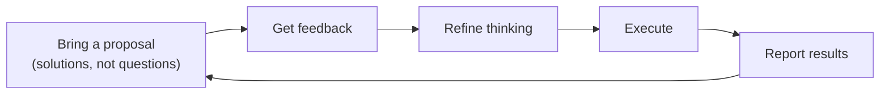

# Managing Up

## Reframe "Managing Up" as Mutual Leverage

**The Problem:** Most people treat their manager like a stakeholder who needs updates and alignment.

**The Solution:** Think of your manager as your highest-leverage partner - you extend their capability to impact the business.

## Key Strategies:

**1. Understand Your Manager's Context**

- What keeps them up at night
- Their key metrics and battles
- How you can amplify their impact

**2. Use the Proposal-Feedback Loop**

- Bring solutions, not questions
- Get feedback to refine thinking
- Execute and report results
- Builds trust and autonomy

**3. Lead with Business Impact**

- Start with business problem and customer impact
- Then add technical details
- Don't lead with architecture diagrams

**4. Create Decision Boundaries**

- Define what you decide alone vs. with alignment vs. approval
- Especially important in startup/founder relationships
- Revisit as trust grows

**5. Smart Escalation**

- Escalate when it affects multiple teams, threatens metrics, or needs political capital
- Otherwise, solve and communicate after

**6. Efficient Communication**

- Use "inverted pyramid": conclusion first, context second, details last
- Make updates scannable, decision-oriented, and future-focused

**Bottom Line:** Your manager spends 5% of their time thinking about your work while you spend 90%. Bridge this gap by becoming their strategic extension, not just a report.
