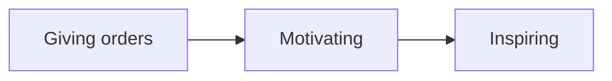

# Team Management: Three Levels

I can definitely help with your team management challenges. It sounds like you're facing a common situation in startups - talented individuals who may not be aligned with structured processes needed as the company scales.

You're right to be thinking about moving from simply giving orders to motivating your team. Here are my recommendations:

### Connect Process to Purpose

Rather than focusing solely on process compliance, help your team understand the "why" behind these standards:

1. **Show, don't just tell**: Use specific examples where lack of testing, documentation, or maintainable code created issues. Real consequences are more persuasive than hypothetical ones.
2. **Quantify the impact**: Track and share metrics like "hours spent debugging undocumented code" or "customer-reported bugs in untested features" to make the cost visible.
3. **Link to their growth**: Frame these processes as professional development that will make them more valuable engineers in their careers.

### Make It Collaborative

Your instinct about 1-on-1s is good, but consider these approaches:

1. **Co-create standards**: Rather than imposing processes, involve the team in defining them. Ask "What documentation would you wish existed when you join a new project?" or "What testing approaches have you found most valuable?"
2. **Start with pain points**: Begin 1-on-1s by asking "What's the most frustrating part of your current workflow?" Then position your processes as solutions to their problems.
3. **Implement gradually**: Introduce one process improvement at a time rather than a comprehensive overhaul.

### Build Accountability Through Ownership

1. **Designate process champions**: Identify team members who naturally gravitate toward quality and empower them to lead by example.
2. **Create peer review mechanisms**: Implement code reviews or documentation reviews as part of your workflow.
3. **Celebrate wins**: Recognize and reward when following processes leads to clear benefits like fewer bugs or faster onboarding.
