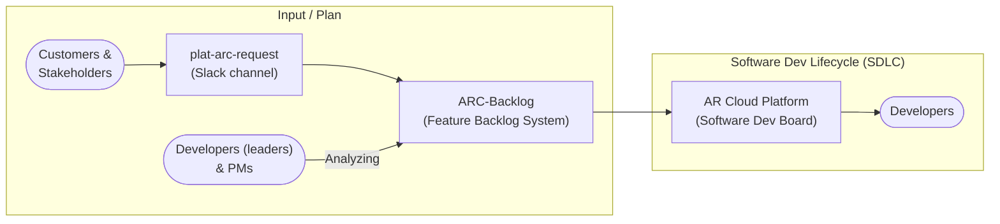

# Feature Analysis Process

## Context

Following the plan in [the stakeholder communication](the-stakeholder-communication.md), before the planning phase, analyzing the feature request properly is the first step. On this page, we will talk about the process in the AR Cloud team.

## The Boards

- **Software Dev Board**: Manage the whole feature development cycle.
- **Feature Backlog System**: Collect new feature requests and analyze them.

## The Process

Input and Planning Phase

- The stakeholders and customers request new features.
- We collect the new features on the Feature Backlog System, to keep the history of the analysis and discussion.
- The dev team will analyze the features, such as scope, severity, priority, complexity, …etc.

Development Phase

- Once the dev team finishes the analysis, we will create epics or tickets and put them on the Software Dev Board
- As the epic or tickets are created on the Software Dev Board, the feature is ready to implement and track the progress.
