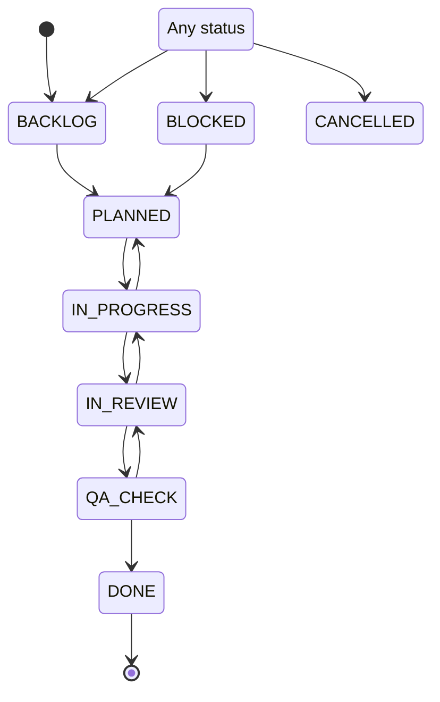

# JIRA task management



## Context

Jira provides a decent channel for PdMs and the dev team to communicate the requirements, expectations, progress tracking, and releases.

Managers need to know how to use Jira to manage tasks, see [How to scrum](https://pretia.atlassian.net/wiki/spaces/SD/pages/1789526067/How+to+scrum). The objective is to have sufficient information to monitor multiple teams and projects, dependencies, and team capacity; provide proper estimations of the deliverables

Individual contributors should put progress on their Jira tickets regularly, and provide sufficient visibility for managers to track the progress.

- When to update:
  - Before a weekly meeting, or any status check, e.g. regular meeting, stand-up
  - Regular: Daily update before calling it a day, and should no longer than one week.
- What to update: Jira comment template
  - Worklog: It's a place to record footprints of the progress
  - Detail: See later sections
- PIC: Managers, leads, and senior developers should follow the rules and make sure people follow them.

## Template: What to update for each status

Status change means a new action happens, and instead of leaving it blank, the ticket owner should add comments accordingly.

### Status: IN PROGRESS

```text
Status: plan, risk, actions, time estimation
Work logs (optional, easy for context switching)
```

### Status: BLOCKED

The ticket owner should notify the PdM that the ticket is blocked, and take the corresponding actions, e.g. check the blocker regularly

```text
Blocked by what/who (PIC if any):
When we should revisit it (timeframe):
```

### Status: IN REVIEW

The ticket owner should notify a reviewer and PdMs:

- To a reviewer: Provide the necessary information, e.g. feature list, branch, and test results.
- To the PdM: Who will be the reviewer, and take responsibility for querying the reviewer about the status regularly
- The reviewer should be your manager by default.

```text
For ticket owner
- Who and what to review:
- Changes (commit id):
- Test report:
For reviewer
- Review progress:
```

### Status: DONE

For an implementation, the template would be

```text
Design doc (link):
Code repository (commit id):
Test report (link):
```

For an issue report, the template would be

```text
Symptom:
Analysis:
Root cause:
Solution:
Fix (commit id):
Test report (link):
```

For others, the template would be

```text
Conclusion:
Actions:
```
