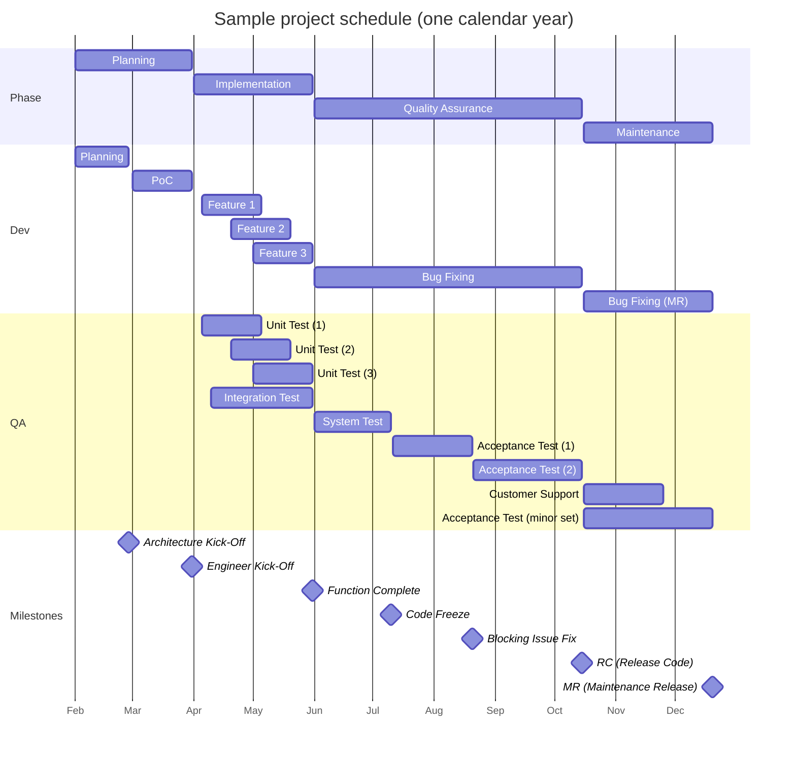

# Project Management Milestones

## Sample Schedule

## Milestones

### Architecture kick-off

This is the end of the estimation, the business team and dev team need to clarify the customers' requirements, define specifications, and break them down into a feature list. This milestone is to confirm we have all the information and are ready for the PoC. (See [SDLC / Analysis & Design](software-development-lifecycle.md#analysis))

### Engineering kick-off

When the requirement and project scope are confirmed, a proof-of-concept or prototype should be delivered. This milestone is to confirm the business logic is feasible and reduce uncertainties. (See [SDLC / Design & Implementation](software-development-lifecycle.md#design))

### Function complete

This is the end of implementation, and the milestone to see if the product features are ready for the QA process. The milestone should check if developers finish the features with tests such as unit tests, and integration tests. (See [SDLC / Implementation & QA](software-development-lifecycle.md#implementation))

### Code freeze

According to the delivery deadline and quality requirement, the PdM should decide on a firm deadline for the shipping code preparation, and focus on stability and performance issues. This milestone is called "Code Freeze".

The code freeze means no more bug fixes and the QA team will focus on stability and performance tests from this milestone. That also means all the bugs should be fixed before the Code Freeze milestone, and after this milestone, the product is more stable and there should be only a few issues left and the QA will only focus on those regression tests. (See [SDLC / QA & Deployment](software-development-lifecycle.md#quality-assurance))

### Code release

This is a final review of all the unsolved issues, according to the issue impacts to decide if the product is ready to ship, or if some bug fixes are able to be waived to the MR release or call a delay. (See [SDLC / Deployment](software-development-lifecycle.md#deployment))

### Maintenance release

After the product is shipped, if there is any bug report from end-users, the PdM will decide if the dev team should solve them according to the impact, then initiate a regression test process to deliver bug fixes in the maintenance release. (See [SDLC / Support & Maintenance](software-development-lifecycle.md#support--maintenance))

## Meetings

### Kick-off meeting

- Participants: PM, developers
- Architecture Kick-off (AKO), Engineer Kick-off (EKO)
- Lock-down architecture, feature list, schedule, deliverables, final production date

### Project meeting

Regular status check and discuss blockers if any

- Participants: PM, developers, testers
- Review issues by each milestone
- Note:
  - Our sprint cycle is similar to this, but this is mainly a reviewing meeting, to review feature implementation status & all issues.
  - For development, each team has its own dev cycle running in parallel. And it only cares about those features blocking other teams.

### Function complete meeting

Decide if it's ready for QA

- Participants: PMs, developers, testers
- It's an internal milestone to have someone review the feature deliverables from the dev team
- Check the test results based on the requirements/specifications
- The tests are unit tests, integration tests, and regression tests (see [SDLC](software-development-lifecycle.md))

### Release meeting

It's a meeting to review the release code quality and determine what solutions should be in the final release code.

- Participants: PM, developers, testers
- Time: a certain time ahead of the RC date
- Discuss blocking issues, code freeze date, RC date
- If this is a multitenant solution, the PdMs need to pick up bug fixes and release them for different SKUs (Stock Keeping Units, customers)

### Maintenance release meeting

- Similar to RC meeting but on smaller scales, regarding changes, tests, …etc.

## Reference

When the team makes decisions, they will always consider what the impacts are of a defect.

### Priority and severity

- Severity
  - How does it impact the user experience/features
  - Decided by the tester, according to feature/function list, for example:
    - S1: feature/system is not working, block the workflow
    - S2: feature/system is working with some defects, not blocking the workflow
    - S3: feature/system is working with minor defects, not blocking the workflow
- Frequency:
  - How frequently do the defects appear?
  - It's a factor that will impact the decision of priority, or defer a defect.
  - The same symptom with a high reproduction rate (8/10) and low reproduction rate (1/10, or once) will be different priorities.
- Priority
  - Overall fixing the order of a defect
  - The PM will decide the priority and decide the blocking defects while releasing
  - It will be changed in the project meeting/bug review meeting
