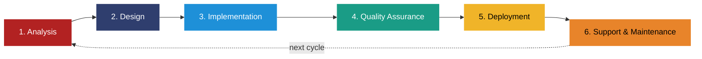

# Software Development Lifecycle

Software Development Life Cycle (SDLC) is the term used to describe the sequence of activities and tasks within the software development process.

The classic SDLC consists of six main stages, which any software product goes through:

- Analysis
- Design
- Implementation
- Quality Assurance
- Deployment
- Support & Maintenance

At each stage, different actions are required, but all of them are aimed at achieving the same goal: to create an efficient, cost-effective, and high-quality software product.

## Analysis

The first SDLC stage is the analysis of the technical and business requirements imposed on the end product. The definition of detailed requirements will guarantee that the tasks will be set correctly and in practice, you will get exactly what you need.

At this stage, it is necessary to receive information from all parties of interest: customers, developers, project managers, and end users.

You need to get answers to the following questions:

- What tasks should the product cope with?
- What resources are available?
- Who will use the system and which way?
- What are the ways to solve the problems?
- What risks can you face during the implementation process?

In addition to identifying requirements for the software product, this stage involves their systematization, documentation, analysis, and, if necessary, adjustment.

All the obtained details of the future software may be stored in the document called Software Requirements Specification (SRS), which is, if absolutely flawless and well-defined, to be a guidebook for a development team.

## Design

After getting a good grasp of the basic technical requirements, the design stage begins. At first, it can be a simple prototype, which shows the shape of the system in general, and then you can proceed to create [low-fidelity wireframes](https://lvivity.com/mobile-app-wireframing-tools).

The design stage helps to create the overall architecture of the system and determine which technologies and programming languages you will be using for the project development. Understanding how the system will look and function allows you to identify hardware and system requirements. In general, all is laid down in a special document: Design Specification Document (DSD).

The functional requirements for the interface are to be determined, for example, the types of data received, input mediums, user interaction logic, etc. It is at this stage that the initial idea begins to develop into a functioning system.

## Implementation

After approving the product requirements and design, there is a transition to the next stage of the lifecycle: implementation or development of the functional end. Here we start coding, based on previously formed documentation (SRS). Therefore, this SDLC stage takes the longest.

If hardware is used, this stage also includes configuring and adjusting the equipment in order to fulfill specified technical requirements. The client can already see the product in operation and assess its compliance with the original specification.

Developers can use different approaches to implementation, depending on the size of the project and resource availability. For larger enterprise projects, Waterfall (project development methodology) is a good choice, and for smaller ones, where flexibility comes first – Agile methodologies are preferred.

## Quality assurance

The purpose of the quality assurance stage (or testing phase) is the detection and document's compliance with all the initial technical and functional requirements. Work on the elimination of bugs continues until the product functionality fully meets the original specification.

Testing can be performed by a special team of employees or real users (sometimes called Beta testers) and additionally divided into manual or automated testing. The main goal is to make sure that the real results of the software performance are up to the desired ones.

In light of the need to satisfy end users and provide them with a positive experience, testing becomes an increasingly important stage of the software development life cycle.

## Deployment

The deployment stage begins once the system has been tested and recognized as being ready for real operation. The complexity of deployment is determined by the scope of the project work, so it can be realized as either a one-time release or a step-by-step launch. In this case, all begins with one module, and then the rest are gradually added.

Such a method as beta testing was widely used as well. That is the release is initially positioned as a beta version, and if users (or clients) find errors or a malfunction in individual functional elements in the process of its use, they report them to the developers. Based on the feedback, engineers make all necessary changes or correct errors, and later the final deployment takes place.

## Support & maintenance

When customers begin utilizing the finished product in real life, various problems occasionally appear, which need to be dealt with in order to maintain the system's performance. Also, occasional technical support of the system is needed in order to maintain its relevance in terms of technologies and modern standards.

At least it is necessary in order to minimize security threats. Also, a technical maintenance team helps to collect and systematize various performance indicators of the software in real-time mode.

Regular error correction and system improvement help to make the software better so that it is up to the requirements and expectations of users as much as possible. In the real world, the environment is constantly changing, and no matter how ideal the original plan seemed to be, rarely it remains the same when faced with reality.

## Further reading

- <https://lvivity.com/sdlc-overview>
- [V-model in software development](v-model-in-software-development.md)
