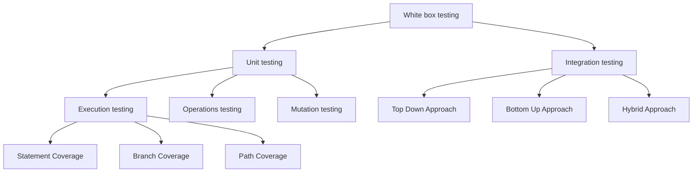

# Software Testing

*Types of white box testing (after [softwaretestinghelp.com](https://www.softwaretestinghelp.com/white-box-testing-techniques-with-example/)).*

### Box Testing

Black Box Testing and White Box Testing

- White box testing
  - Inner workings of an application and revolves around internal testing.
    - The flow of specific input through the code, then have expected output.
    - Testing of each statements, object and function on an individual basis.
  - Unit Test & Integration Test
    - how to test features? pass criteria
    - what's the stability? sustained
- Black box testing
  - From an external or end-user type perspective.
  - System testing
  - Acceptance testing (totally from end-user perspective)

### Endurance Testing

- The goal is to discover how the system behaves under sustained use.
- Keep it run for some long period of sustained activity.

### Stress Testing

- This test mainly measures the system on its robustness and error handling capabilities under extremely heavy load conditions

### Reference

- <https://www.softwaretestinghelp.com/white-box-testing-techniques-with-example/>
- <https://www.toptal.com/qa/how-to-write-testable-code-and-why-it-matters>
- <https://www.guru99.com/white-box-testing.html>
- <http://tryqa.com/what-is-endurance-testing-in-software>
- <https://www.guru99.com/stress-testing-tutorial.html>
