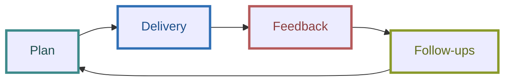

# The Stakeholder Communication

## Context

The ARC team is constantly requested new features and improvements from the stakeholders, so we would like to create a stakeholder communication channel to keep them updated and understand the progress, plan, and roadmap of all the tasks.

This document is about the communication strategy for stakeholder engagement.

## 4 Steps for Stakeholder Engagement

### Plan

Roadmap & Milestone: Giving stakeholders the idea product plan, inducing feature lists, team capacity arrangement, …etc. For example, a presentation of a quarterly roadmap would be a great medium to give the expectation for the following three months.

### Delivery

Make sure all information regarding your project is presented in a transparent way, the sprint review is a great chance to demonstrate the dev team's progress and make stakeholders understand the project and achievements, e.g. release announcement, sprint review, …etc

### Feedback

Collect requests and improvements from stakeholders, the dev team should have surveys periodically and make improvements from the feedback, e.g. the slack channel "*plat-arc-request*".

### Follow-ups

Provide feedback to stakeholders on how their interests and issues are addressed and resolved, and keep a careful record of all aspects of stakeholder communications over time, e.g. the Jira "*ARC-Backlog*".

After collecting feedback, the dev team will have the analysis and come out with the action items and plans for putting the actions into the milestones in the future.

## Communications

Among the 4 stakeholder engagement steps, there are asynchronous/synchronous mediums and we will work in mixed ways and adjust from time to time.

### Asynchronous

Getting ***feedback*** and addressing the ***follow-ups*** would be better run in asynchronous ways.

### Synchronous

For the ***plan*** and ***delivery***, it's effective to have stakeholders in a meeting and present it. The PM should schedule an appointment and have stakeholders for retrospectives periodically, e.g. monthly, bi-monthly, or quarterly would be good.
