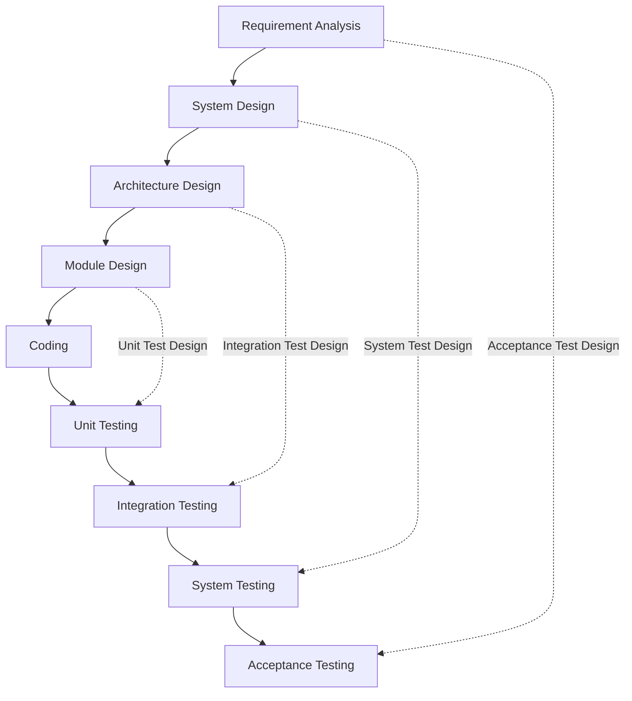
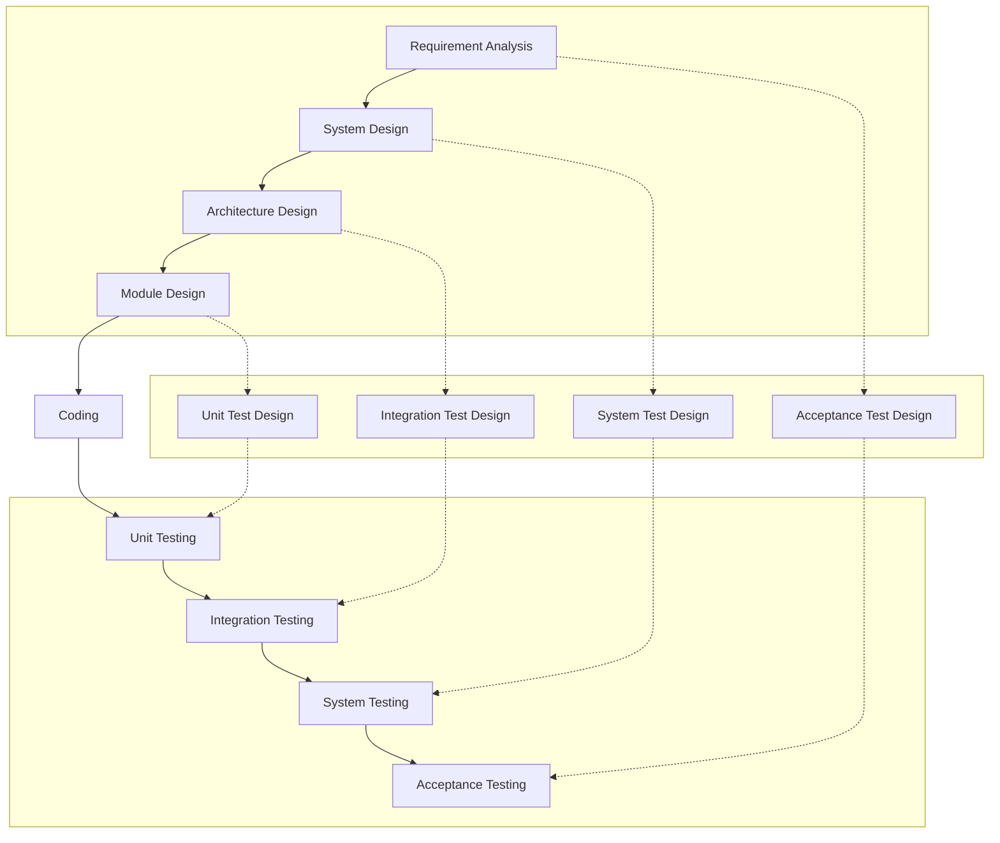
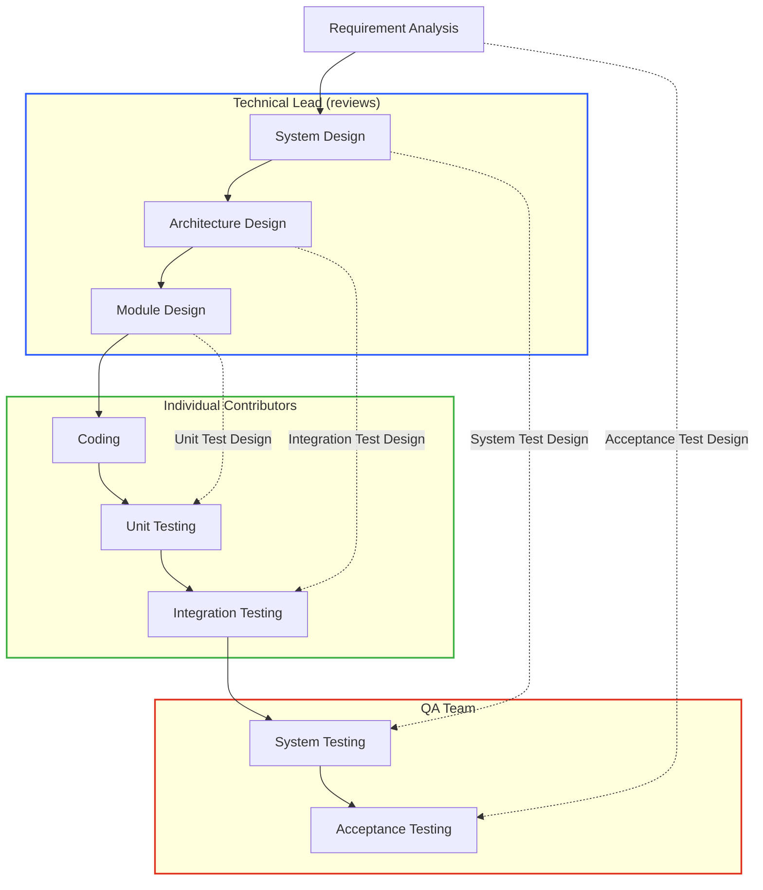

# V-model in software development

- [What Is the V-Model? (Definition, Examples) | Built In](https://builtin.com/software-engineering-perspectives/v-model)
- [SDLC - V-Model](https://www.tutorialspoint.com/sdlc/sdlc_v_model.htm)
- [SDLC V-Model - Software Engineering - GeeksforGeeks](https://www.geeksforgeeks.org/software-engineering-sdlc-v-model/)

## The V-model

Each design phase on the left arm of the "V" produces the test design that is verified by the matching testing phase on the right arm.

The same model, with the test-design artifacts drawn explicitly in the middle of the "V":

## Role and responsibility

| V-model phases | Owner (Responsible) | Reviewer (Accountable) |
| --- | --- | --- |
| Requirements analysis | Individual contributors | Technical lead |
| System design | Individual contributors | Technical lead |
| Architecture design | Individual contributors | Technical lead |
| Module design | Individual contributors | Technical lead |
| Unit testing | Individual contributors | Technical lead |
| Integration testing | QA team / Individual contributors | Technical lead |
| System testing | QA team | Product/Project manager |
| Acceptance testing | QA team | Product/Project manager |
